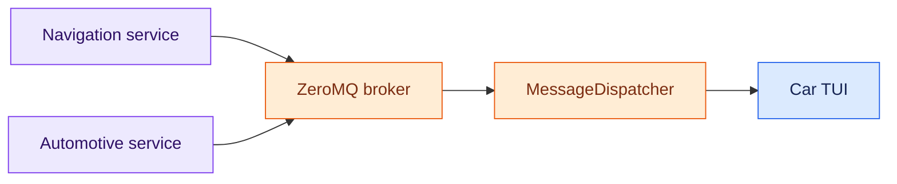

# Car TUI

`apps/carTui` is the terminal counterpart to Car UI. It provides a curses home menu and navigable automotive destinations while using reusable views under `frontends/tui`.

Included destinations include:

- Off-road navigation: heading, pitch, roll, acceleration, angular velocity, GPS state, calibration, and relative-heading reset.
- Vehicle telemetry: RPM, speed, boost, temperatures, pedal/load values, pressures, airflow, fuel, and module voltage.
- Radio: FM broadcast, scanner, AM aviation, and FM weather-band receivers with tuning, presets, and receiver telemetry.

## Telemetry architecture

Car TUI is a consumer of the OpenRoadCode message bus. Navigation and vehicle state are supplied by producer services rather than by constructing navigation or OBD-II hardware inside the TUI.



`NavigationBusState` and `VehicleBusState` cache the latest decoded snapshots for the UI thread.

## Start Car TUI

From the repository root:

```bash
python3 -m apps.carTui.main
```

Use `--config PATH` to select a runtime file when needed.

## Full simulated telemetry stack

A simulation runtime should select simulated sources in the producer services. The application itself follows the same subscriber path used with physical hardware.

Start the broker:

```bash
python3 -m messaging.zeromq.broker_cli
```

Start simulated navigation:

```bash
python3 -m services.navigation.navigation_service_cli \
  --config config/runtime_simulation.toml
```

Start simulated automotive telemetry:

```bash
python3 -m services.automotive.automotive_service_cli \
  --config config/runtime_simulation.toml
```

Then start Car TUI:

```bash
python3 -m apps.carTui.main
```

This exercises the same ZeroMQ contracts, dispatcher, shared state, and TUI rendering that will be used with physical sources.

## Units

OpenRoadCode telemetry contracts remain SI-normalized. Car TUI converts values only for presentation using `common.units`.

The unit preference is shared by the Navigation and Vehicle screens. Press `u` on either screen to toggle between metric and imperial presentation. The underlying `NavigationBusState`, `VehicleBusState`, and ZeroMQ messages are not modified.

## Controls

Home controls are arrow keys or `j`/`k`, Enter to open, and `q` to quit. Inside a destination, `b` or Escape returns home and `q` exits the application.

On Navigation and Vehicle screens, `u` toggles metric/imperial presentation.

Radio controls are `1`–`4` to select FM, scanner, airband, or weather band; `p` toggles the selected receiver; Left/Right tunes by one mode-specific step; and `[`/`]` selects the previous or next preset.

## Physical telemetry

Physical navigation sources are selected in runtime TOML with `source = "device"` for the IMU and GPS inputs. The navigation service owns those devices and continues publishing the same contracts.

Physical automotive/ELM327 composition is not yet enabled in `services.automotive`; `source = "device"` currently fails explicitly. Once connected, it will replace the simulated `VehicleStateSourceIf` without requiring changes to Car TUI.

See `services/navigation/README.md`, `services/automotive/README.md`, `messaging/README.md`, and `docs/messaging/message_bus_idd.md` for service ownership and wire-contract details.
