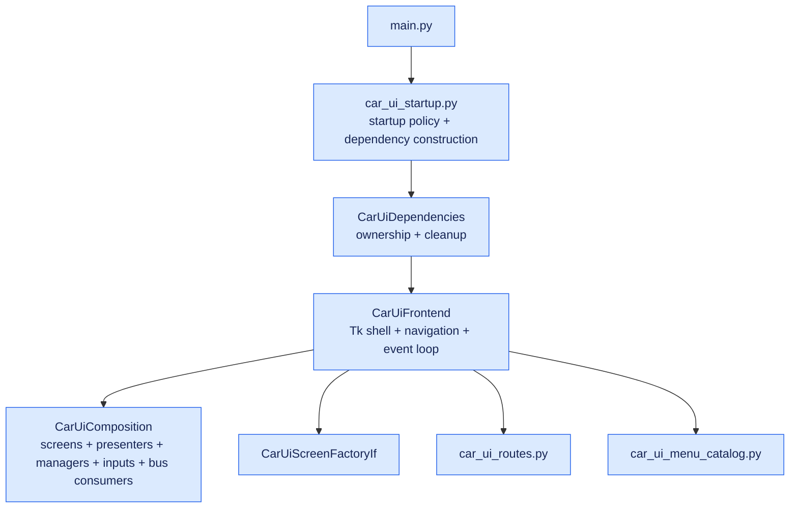
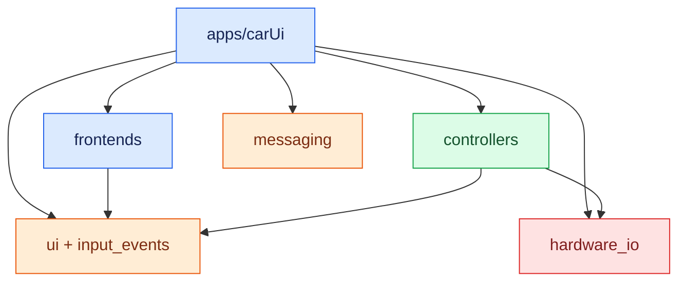

# Car UI Application

`apps/carUi` is the application-specific assembly for the OpenRoadCode vehicle
interface. Concrete Tk widgets live under `frontends/tk`; toolkit-independent
display and request contracts live under `ui`.

## Architecture



Public vehicle and navigation telemetry enters Car UI through `messaging`
contracts. Screens do not open OBD-II, IMU, or navigation telemetry sources for
the purpose of rendering gauges.

The dependency direction remains:



`frontends` must not import `apps.carUi`, controllers, hardware implementations,
or own public telemetry transports.

## Telemetry and command boundary

Car UI treats observation and control as different responsibilities:

- `vehicle.state` feeds the configurable vehicle gauges.
- navigation attitude, IMU, position, and motion topics feed the off-road panel.
- `CarUiComposition` owns the ZeroMQ subscriber/dispatcher and marshals decoded
  messages onto the UI thread.
- Screens are passive telemetry consumers. Showing or hiding a screen does not
  connect or disconnect the physical telemetry producer.
- Calibration and relative-heading reset are commands, not telemetry. They use
  `NavigationRequestHandlerIf` when a command-capable navigation service is
  supplied. The bus migration does not disguise commands as state messages.

This keeps hardware acquisition independent of the number or lifetime of UI
consumers. Car UI, Car TUI, Web UI, and standalone dashboards can observe the
same public state without each opening the same device.

## Main components

- `car_ui_frontend.py` owns the window shell and frontend event loop.
- `car_ui_composition.py` connects screens, presenters, managers, inputs, and
  public telemetry subscriptions.
- `car_ui_frontend_if.py` defines the toolkit-neutral shell surface consumed by
  composition.
- `ui/menu/` owns toolkit-independent `MenuPage` and `MenuTile` models.
- `screens/car_ui_screen_factory_if.py` keeps concrete screen construction
  behind a replaceable frontend boundary.
- `car_ui_startup.py` selects concrete runtime dependencies and configures the
  branded startup splash.
- `car_ui_dependencies.py` owns constructed resources and performs idempotent,
  best-effort cleanup.
- `screens/vehicle_gauges_screen.py` renders decoded `VehicleStateMessage`
  snapshots received from composition. It does not own ELM327 polling.
- `screens/offroad_dashboard_screen.py` renders decoded public navigation
  messages. It does not poll the MPU-6050 or position provider.
- `runtime/` translates Car UI configuration into controllers, launchers, and
  hardware adapters for application-owned command and platform services.

## Resource ownership

`CarUiDependencies.close()` stops application-owned input devices, launchers,
media resources, command-capable controllers, lighting, and the shell position
provider. Public telemetry producer processes remain independent of a Car UI
window close.

Startup uses an ownership stack. If dependency construction fails partway
through, already-created resources are released in reverse construction order.

## Run

From the repository root:

```bash
CARUI_SPLASH=0 \
CARUI_GEOMETRY=1024x600 \
CARUI_FULLSCREEN=0 \
venv/bin/python -m apps.carUi.main
```

An X11 display must be available through `DISPLAY` or `CARUI_DISPLAY`.

Car UI detects `linux-dev`, Raspberry Pi 4, and Raspberry Pi 5 deployments to
select platform services such as audio control. Override detection when needed:

```bash
OPENROAD_RUNTIME_TARGET=linux-dev venv/bin/python -m apps.carUi.main
```

The main-menu `Gauges` page includes the configurable vehicle cluster and the
off-road dashboard. Both now wait for their public bus telemetry when the
corresponding producer is not running; they do not silently instantiate a
second hardware reader.

Browser-hosted media can use a different X display from radio and auxiliary
applications through `runtime.media_display` or `CARUI_MEDIA_DISPLAY`.
Weather and ADS-B dashboards similarly use `runtime.auxiliary_display`.

### Position provider

The shell position provider remains an application service for map centering,
weather lookup, and top-bar location. Public navigation position telemetry is a
separate observation path and is consumed by telemetry-oriented screens.

To use browser position for the shell provider:

```bash
CARUI_POSITION_SOURCE=browser \
CARUI_SPLASH=0 \
venv/bin/python -m apps.carUi.main
```

The last valid shell fix may be persisted and restored for initial display; it
is explicitly last-known data rather than live motion telemetry.

## Test

```bash
venv/bin/python scripts/run_tests.py unit
venv/bin/python scripts/run_tests.py integration
```

Hardware-related suites may require optional platform packages such as `evdev`.

## Documentation

The toolkit-independent contract guide is in `ui/README.md`, reusable frontend
conventions are in `frontends/README.md`, and the repository-wide application
telemetry audit is in `docs/apps_architecture_audit.md`.
