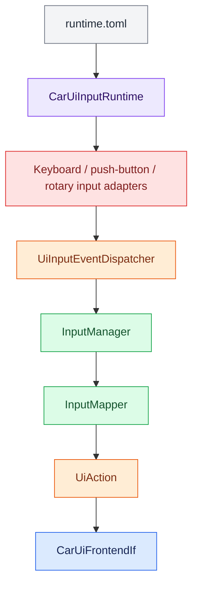

# Car UI Input Routing

Car UI input is split across hardware, controller, frontend, and application
runtime boundaries.

## Architecture

<aside class="orc-diagram-legend" aria-label="Architecture diagram legend">
  <strong>Diagram key</strong>
  <span><i class="orc-legend-swatch orc-legend-app"></i>App / UI</span>
  <span><i class="orc-legend-swatch orc-legend-service"></i>Service / runtime</span>
  <span><i class="orc-legend-swatch orc-legend-controller"></i>Controller / domain</span>
  <span><i class="orc-legend-swatch orc-legend-message"></i>Messaging / contract</span>
  <span><i class="orc-legend-swatch orc-legend-adapter"></i>Protocol / hardware</span>
  <span><i class="orc-legend-swatch orc-legend-external"></i>External / input</span>
</aside>



`RotaryEncoderInputAdapter` translates one `RotaryEncoderIf` into generic
`InputEvent` values. `frontends/common/input/UiInputEventDispatcher` queues
those values until the frontend event-loop thread drains them.

The neutral `InputEvent`, `InputDeviceId`, and `InputHandlerIf` contracts live
under `input_events`. This lets controllers and frontend queues share physical
input values without either layer depending on the other.

`KeyboardInputAdapter` accepts `KeyboardReaderIf`; the current runtime supplies
the optional Linux `KeyboardReader` implementation. It and
`PushButtonInputAdapter` publish through that same
queue. Keyboard key names are mapped by `InputMapper`; standalone pushbuttons
use an explicit `InputDeviceId` to `UiAction` mapping so physical button
numbers do not acquire hidden application meaning.

`apps/carUi/runtime/CarUiInputRuntime` owns the configured adapters, polling,
partial-device failure handling, and shutdown. `InputMapper` alone assigns
semantic meaning such as navigation, selection, volume, and mute.

## Encoder identity

The configured `volume_index` selects one device for global system-volume
control. Its rotation is never forwarded to a panel. Pressing its button
toggles system mute; releasing it has no additional action.

Remaining devices map to general navigation actions in configured device
order. Panels receive `UiAction` values through the active screen; they do not
receive physical encoder callbacks.

## Threading

Hardware callbacks enqueue events. `CarUiInputRuntime` polls adapters and
drains the common frontend queue through `UiDispatcherIf`, ensuring UI actions
execute on the frontend thread. This works with Tk today and permits a future
Qt dispatcher.

The runtime accepts optional keyboard readers and standalone pushbuttons.
They are not enabled by the current default Car UI TOML; rotary-encoder buttons
are already included through each `RotaryEncoderInputAdapter`.

Example configuration:

```toml
[input.keyboard]
enabled = true
device_path = "/dev/input/event3" # optional; auto-detected when omitted

[[input.push_buttons]]
pin = 11                         # physical Raspberry Pi header pin
action = "home"
active_low = true
debounce_seconds = 0.05

[[input.push_buttons]]
pin = 13
action = "back"
```

Supported standalone-button actions are `back`, `home`, `select`,
`navigate_up`, `navigate_down`, `volume_up`, `volume_down`, and
`volume_mute`. Keyboard and GPIO dependencies remain optional and are imported
only when their corresponding devices are enabled.

Car UI dependency ownership also uses `KeyboardReaderIf`, so alternate
keyboard sources can be injected without changing composition, input mapping,
or cleanup code.

`pin` is a physical Raspberry Pi 40-pin header number, not a BCM number.
Configured standalone pins must be unique and cannot overlap GPIO rotary
encoder pins. `active_low = true` enables the normal pull-up wiring where the
button connects the input to ground. `debounce_seconds` must be non-negative.

## Platform requirements

Keyboard input requires the optional `evdev` package and permission to read
the selected `/dev/input/event*` device. When `device_path` is omitted,
`KeyboardReader` attempts to locate a keyboard-like device. Linux permissions
are commonly provided through the appropriate input-device group or a udev
rule; avoid running the complete UI as root solely to access input devices.

Standalone pushbuttons require Raspberry Pi GPIO support and `gpiozero`.
They are instantiated only when the application is running on a Raspberry Pi.
The default configuration leaves keyboard input disabled and contains no
active standalone pushbutton entries.

## Lifecycle

Startup parses the input schema, constructs enabled devices, and transfers
them into `CarUiDependencies`. `CarUiInputRuntime` connects their controller
adapters and drains events on the frontend thread. Shutdown disconnects the
adapters and then closes or stops the owned hardware resources. A connection
failure for one constructed device does not prevent the remaining devices from
running; a configured device whose optional Python dependency is missing is a
startup configuration error.

## System volume component test

Run:

```bash
python3 -m apps.carUi.input.component_test.volume_encoder_cli
```

This loads the production TOML but constructs and starts only the device
selected by `volume_index`. Contextual devices are intentionally not started,
so a disconnected panel encoder cannot prevent testing the volume knob.

The test changes the actual default PipeWire sink volume and prints the
resulting level after each rotation step. It requires `wpctl` and the configured
volume encoder hardware. It reports 20 levels by default, matching the default
5% PipeWire increment; the Car UI's eight bars are only a visual indicator.
The PipeWire controller limits positive adjustments to 100%.

The production `VolumeManager` maps the 20-level audio range proportionally to
the top bar's eight segments. For example, levels `5`, `10`, `15`, and `20`
display two, four, six, and eight bars respectively. While muted, all bars are
rendered in red so mute is distinguishable from volume zero.

## Automated tests

```bash
python3 -m unittest \
    apps.carUi.runtime.unit_test.test_car_ui_input_runtime \
    apps.carUi.input.unit_test.test_volume_encoder_cli \
    frontends.common.input.unit_test.test_ui_input_event_dispatcher \
    controllers.input.unit_test.test_input_adapters \
    config.integration_test.test_input_device_config
```
