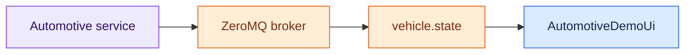

# Automotive UI Demo

This curses demo is a consumer of the same public automotive telemetry contract used by CarUi and CarTui. It does not create an OBD-II controller, ELM327 device, or simulated vehicle locally.

## Architecture

<aside class="orc-diagram-legend" aria-label="Architecture diagram legend">
  <strong>Diagram key</strong>
  <span><i class="orc-legend-swatch orc-legend-app"></i>App / UI</span>
  <span><i class="orc-legend-swatch orc-legend-service"></i>Service / runtime</span>
  <span><i class="orc-legend-swatch orc-legend-controller"></i>Controller / domain</span>
  <span><i class="orc-legend-swatch orc-legend-message"></i>Messaging / contract</span>
  <span><i class="orc-legend-swatch orc-legend-adapter"></i>Protocol / hardware</span>
  <span><i class="orc-legend-swatch orc-legend-external"></i>External / input</span>
</aside>



The automotive service owns hardware or simulation and publishes normalized SI `VehicleState` telemetry. The demo subscribes to `VEHICLE_STATE_TOPIC`, decodes `VehicleStateMessage`, and presents those values through the existing automotive UI contracts.

## Run

Start the ZeroMQ broker and automotive producer service first. Then run:

```bash
python3 -m apps.demos.automotive.main
```

The subscriber endpoint comes from `config/runtime.toml`.

Controls:

- `q` or Esc: quit
- `u`: toggle SI/imperial display units

The legacy demo controller is no longer part of the runtime path. Diagnostics commands are not currently transported by the public automotive service, so the old local clear-diagnostics action is intentionally not wired to the telemetry consumer.
