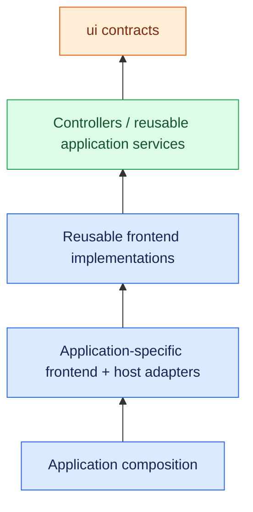

# orcUi Architecture

## Purpose

`apps/orcUi` is the application assembly and runtime layer for the integrated OpenRoadCode UI. It also owns presentation that is specific to the orcUi application itself.

OpenRoadCode deliberately separates semantic UI contracts, reusable behavior, reusable frontend rendering, application-specific presentation, host/platform adapters, and application composition so that a feature can be presented by Tk, web, Android, or another frontend without moving its controller logic into the application shell.

## Dependency boundaries

`ui/` is the toolkit-independent semantic boundary. Contracts there describe user intent, presentation state, semantic identifiers, and narrow frontend-facing behavior. Code in `ui/` must not depend on Tkinter, application composition, transport implementations, controllers, or hardware implementations.

`controllers/` owns reusable behavior and integration logic. Long-lived workers, state synchronization, protocol behavior, playback coordination, and similar reusable behavior do not belong in `orcUi` or in a concrete frontend.

`frontends/<frontend>/` owns reusable concrete presentation for a toolkit or delivery surface. For Tk specifically, `frontends/tk` is the reusable Tk ecosystem. Feature packages such as `frontends/tk/media`, `frontends/tk/radio`, `frontends/tk/automotive`, and `frontends/tk/games` should depend on narrow contracts rather than on one application shell.

`apps/orcUi/frontend/tk` owns the integrated orcUi Tk root window, shell chrome, HOME layout, context rail, structural navigation/vehicle/off-road panels, power dialog, and other Tk presentation that exists specifically because of the orcUi application layout.

`apps/orcUi/adapters` owns ORC-selected host/platform bridges. These include browser lifecycle adaptation, the local Spotify Web Playback host, and ADS-B launcher/config adaptation. They may know about launchers, local services, protocols, configuration, and host details. Reusable controllers and reusable frontend packages must not know about them.

`apps/orcUi` also owns assembly, application-specific runtime adapters, presenters used by the assembly, and resource lifecycle. Composition may select reusable frontend implementations and combine them with application-specific presentation and host adapters.

The intended direction is:



A concrete application frontend and composition root are allowed to know which reusable frontend components and host adapters they selected. Reusable controllers, UI contracts, and reusable frontend packages must not know which application selected them.

## Entry point and assembly

`python -m apps.orcUi` enters `main.py`, which does one thing: create the application composition and run it. It does not re-export the concrete Tk shell.

```mermaid
flowchart TD
    main["apps/orcUi/main.py"] --> appComposition["composition/application.py"]

    appComposition --> runtime["OrcUiApplicationRuntime"]
    appComposition --> core["composition/core.py"]
    appComposition --> radio["composition/radio.py"]
    appComposition --> games["composition/games.py"]
    appComposition --> media["composition/media.py"]

    core --> map["MapRuntime"]
    core --> lifecycle["SystemLifecycleController"]
    core --> volume["SystemVolumeHandler"]
    core --> app["apps/orcUi/frontend/tk/OrcUiApp"]
    core --> ingress["StateIngressRuntime"]

    radio --> reusableRadio["Reusable Tk radio presentation"]
    radio --> radioShell["orcUi Tk radio shell"]
    radio --> adsb["apps/orcUi/adapters/ADS-B lifecycle"]

    games --> reusableGames["Reusable Tk games presentation"]

    media --> reusableMedia["Reusable Tk media presentation"]
    media --> browser["apps/orcUi/adapters/browser lifecycle"]

    classDef orcApp fill:#dbeafe,stroke:#2563eb,color:#172554;
    classDef orcService fill:#ede9fe,stroke:#7c3aed,color:#2e1065;
    classDef orcController fill:#dcfce7,stroke:#16a34a,color:#14532d;
    classDef orcMessage fill:#ffedd5,stroke:#ea580c,color:#7c2d12;
    classDef orcAdapter fill:#fee2e2,stroke:#dc2626,color:#7f1d1d;
    classDef orcExternal fill:#f3f4f6,stroke:#6b7280,color:#1f2937;

    class main,appComposition,app,radioShell,reusableRadio,reusableGames,reusableMedia orcApp;
    class runtime,core,ingress orcService;
    class map,lifecycle,volume orcController;
    class adsb,browser orcAdapter;
```



`OrcUiComposition` owns the top-level graph and shutdown order. Application/runtime objects own the resources they create. The Tk shell consumes injected runtime interfaces and semantic contracts rather than constructing backend infrastructure itself. `CoreComposition` owns `MapCameraRuntime` and injects its `MapRequestHandlerIf` explicitly through `OrcUiApp` to the HOME and NAVIGATION panels; no process-global map-camera registry is used.

## Tk shell ownership

`apps/orcUi/frontend/tk/orc_ui_app.py` owns the concrete integrated Tk shell. It creates the Tk root, arranges shell chrome and structural panels, manages Tk screen hosting/navigation, paints presentation state, and runs the Tk event loop.

It must not create ZeroMQ subscribers, message decoders, audio backends, Spotify synchronization workers, browser lifecycle managers, external map renderer launchers, or host restart/poweroff implementations. Those dependencies are injected through application/runtime or UI contracts.

Structural orcUi widgets that are meaningful only inside that shell stay under `apps/orcUi/frontend/tk`. A widget that could reasonably be reused by another Tk application belongs in an appropriate feature package under `frontends/tk` instead.

## Reusing Tk for another application

`frontends/tk` is not uniquely tailored to orcUi. A future independent Tk application owns its shell under its own application package:

```text
frontends/tk/
    automotive/
    media/
    radio/
    games/
    ... reusable Tk features ...

apps/orcUi/frontend/tk/
    orc_ui_app.py
    ... orcUi-specific layout ...

apps/alternateUi/frontend/tk/
    alternate_ui_app.py
    ... alternate-specific layout ...
```

That alternate shell can reuse the existing controllers, `ui/` contracts, and generic Tk feature packages. Reusable Tk screens use `TkScreenHostIf`, so another Tk shell can host them by implementing that narrow interface rather than inheriting from or depending on `OrcUiApp`.

If a reusable Tk component begins importing `apps.orcUi` or `apps.orcUi.frontend.tk`, that is an architecture smell. Extract the required operation into a narrow contract rather than coupling the reusable component to the orcUi shell.

## State flow

`core_runtime.py` contains shell-facing runtime adapters. `MapRuntime` owns the external map-renderer lifecycle and renderer-specific theme consequences. `StateIngressRuntime` owns message ingress, decoders, presenter invocation, and scheduling already-presented state onto the UI thread.


Vehicle, position, and attitude remain distinct presentation states. Concrete frontend widgets receive those already-presented states. They do not decode transport payloads or assume a particular sensor implementation.

## System intent

System controls use semantic contracts from `ui.system`.

Volume requests flow through `VolumeRequestHandlerIf`; normalized volume/mute state returns through `VolumeUiIf`. `SystemVolumeHandler` translates those requests to the concrete audio controller.

Restart and poweroff requests flow through `SystemLifecycleRequestHandlerIf`. `SystemLifecycleController` records the requested action, and `OrcUiComposition` executes it only after normal resource cleanup.

## Feature composition

`composition/radio.py` wires application-owned radio services to reusable Tk radio presentation and the ORC-specific radio shell. SDR++/ADS-B presentation details stay outside the reusable radio package. ADS-B host/config lifecycle is an ORC adapter, while managed process lifetime remains explicitly owned.

`composition/media.py` wires shared Spotify services, local-player behavior, image/lyrics/video dependencies, and reusable Tk media screens. Spotify synchronization and local-player behavior remain under `controllers/spotify`; ORC-selected browser and Web Playback hosts live under `apps/orcUi/adapters`.

`composition/games.py` registers the reusable Tk games frontend. Environment-specific launching and compatibility remain backend concerns.

New features should follow the same sequence: define semantic contracts, implement reusable behavior, implement reusable presentation per frontend where appropriate, add application-specific presentation or host adapters only when necessary, then assemble concrete choices at the application composition edge.

## Theme ownership

`theme_runtime.py` resolves `ThemeBundle` values from the shared CSS-derived theme model. Concrete frontends paint those values. Runtime-specific consequences, such as installing a MapLibre style, belong to the runtime that owns that renderer rather than to the shell.

Semantic theme intent may originate from the active application shell. Provider-specific brand colors are allowed where intentional, but application chrome should continue to come from the shared theme model.

## Lifecycle

A resource has one clear owner. The object that creates a process, worker, subscriber, browser host, or other managed resource must expose and own its cleanup behavior.

`OrcUiComposition.run()` starts the assembled graph, runs the selected frontend, then closes games/media/core/application resources in defined order before executing any deferred host lifecycle action.

Do not add independent shutdown paths inside feature screens merely because reaching `subprocess` from a button is temptingly easy.

## Developer verification

From the repository root, run the focused suites relevant to the changed ownership:

```bash
python -m unittest discover -s apps/orcUi/composition/unit_test -p 'test_*.py'
python -m unittest discover -s controllers/system/unit_test -p 'test_*.py'
python -m unittest discover -s controllers/audio/unit_test -p 'test_*.py'
python -m unittest discover -s controllers/spotify/unit_test -p 'test_*.py'
python -m unittest discover -s controllers/application_runtime/unit_test -p 'test_*.py'
python -m unittest discover -s controllers/games/unit_test -p 'test_*.py'
python -m unittest discover -s ui/unit_test -p 'test_*.py'
python -m unittest discover -s frontends/tk/unit_test -p 'test_*.py'
python -m unittest discover -s apps/orcUi/frontend/tk/unit_test -p 'test_*.py'
python -m unittest discover -s frontends/tk/media/unit_test -p 'test_*.py'
python -m unittest discover -s frontends/tk/radio/unit_test -p 'test_*.py'
python -m unittest discover -s frontends/x11/unit_test -p 'test_*.py'
python -m apps.orcUi
```

These tests do not replace an X11 integration smoke test. On Termux/X11, exercise HOME, NAVIGATION/map, VEHICLE, OFF-ROAD state, MEDIA/Spotify, RADIO embedding, GAMES embedding, volume, theme changes, restart, and shutdown.

Before merging a substantial architecture change, review the complete branch diff for stale paths or accidental product behavior changes, run repository quality checks, and perform the GUI smoke test.

## Maintenance rules

- Keep `apps/orcUi/main.py` as a thin composition entry point.
- Keep concrete dependency construction in composition/runtime factories.
- Keep reusable Tk rendering under `frontends/tk`.
- Keep orcUi-specific Tk rendering and layout under `apps/orcUi/frontend/tk`.
- Keep ORC-selected host/platform bridges under `apps/orcUi/adapters`.
- Keep reusable Tk features independent of `OrcUiApp`, `apps/orcUi/frontend/tk`, and app adapters.
- Prefer `TkScreenHostIf` or another narrow contract when reusable Tk presentation needs host services.
- Keep transport decoding and backend resource ownership outside concrete frontend widgets.
- Keep shared icons semantic and frontend rendering local.
- Keep theme values sourced from the shared theme model except deliberate provider branding.
- Remove obsolete compatibility aliases when ownership changes instead of preserving architectural ambiguity indefinitely.
