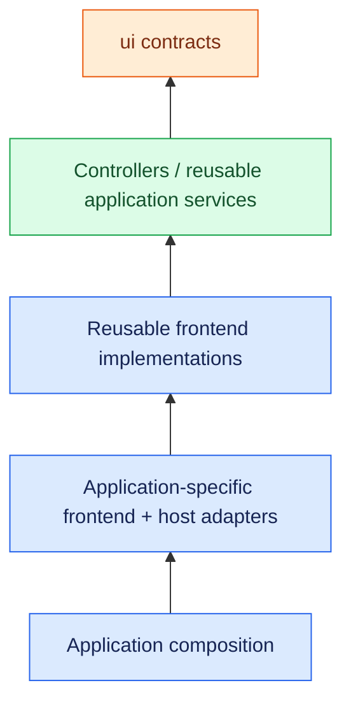
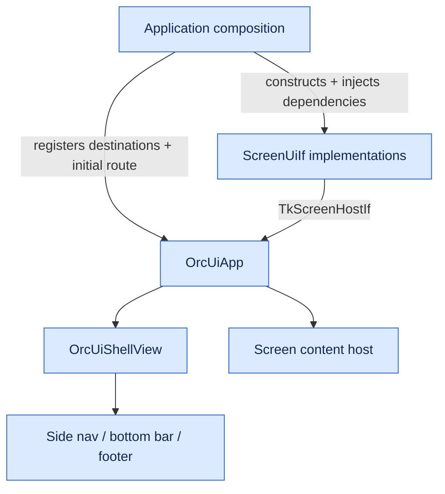

# orcUi Architecture

## Saved destinations

Home and Work use the existing places request contract and POI popup. A shortcut
opens the destination card; its Navigate action emits the route request. Address
text is carried in immutable MapFavorite and PointOfInterest values. Widgets do
not read configuration or call geocoders. The navigation composition's default
favorites store overlays user-owned TOML while preserving legacy JSON favorites.
The separate installer TUI binds destination setup request/presentation contracts;
its composition root owns the local geocoder and whiptail adapter. See
[saved destinations](../../docs/saved_destinations.md) for storage and validation.

## Purpose

`apps/orcUi` is the application assembly and runtime layer for the integrated OpenRoadCode UI. It also owns presentation that is specific to the orcUi application itself.

OpenRoadCode deliberately separates semantic UI contracts, reusable behavior, reusable frontend rendering, application-specific presentation, host/platform adapters, and application composition so that a feature can be presented by Tk, web, Android, or another frontend without moving its controller logic into the application shell.

## Tk control chrome

ORC action buttons and classic check/radio/menu controls explicitly suppress Tk's
platform-default highlight ring and beveled border. These native defaults can
remain white under Termux:X11 even when the widget background and `bd` are set.
Shared Tk helpers follow the same policy. Editable media fields instead use themed
backgrounds and an explicit accent focus edge. Theme-colored card boundaries and
selected-state accents remain deliberate presentation; no UI requests or lifecycle
behavior change with this styling policy. The desktop window-manager frame is
owned by the X11 desktop rather than ORC widget styling.

## Dependency boundaries

`ui/` is the toolkit-independent semantic boundary. Contracts there describe user intent, presentation state, semantic identifiers, and narrow frontend-facing behavior. Code in `ui/` must not depend on Tkinter, application composition, transport implementations, controllers, or hardware implementations.

`controllers/` owns reusable behavior and integration logic. Long-lived workers, state synchronization, protocol behavior, playback coordination, and similar reusable behavior do not belong in `orcUi` or in a concrete frontend.

`frontends/<frontend>/` owns reusable concrete presentation for a toolkit or delivery surface. For Tk specifically, `frontends/tk` is the reusable Tk ecosystem. Feature packages such as `frontends/tk/media`, `frontends/tk/radio`, `frontends/tk/automotive`, and `frontends/tk/games` should depend on narrow contracts rather than on one application shell.

`apps/orcUi/frontend/tk` owns the integrated orcUi Tk root window, shell chrome, HOME layout, context rail, structural navigation/vehicle/off-road panels, power dialog, and other Tk presentation that exists specifically because of the orcUi application layout.

`apps/orcUi/adapters` owns ORC-selected host/platform bridges. These include browser lifecycle adaptation, the local Spotify Web Playback host, and ADS-B launcher/config adaptation. They may know about launchers, local services, protocols, configuration, and host details. Reusable controllers and reusable frontend packages must not know about them.

`apps/orcUi` also owns assembly, application-specific runtime adapters, presenters used by the assembly, and resource lifecycle. Composition may select reusable frontend implementations and combine them with application-specific presentation and host adapters.

The intended direction is:

<div class="orc-diagram-legend" aria-label="Architecture diagram legend">
  <strong>Diagram key</strong>
  <span><i class="orc-legend-swatch orc-legend-app"></i>App / UI</span>
  <span><i class="orc-legend-swatch orc-legend-service"></i>Service / runtime</span>
  <span><i class="orc-legend-swatch orc-legend-controller"></i>Controller / domain</span>
  <span><i class="orc-legend-swatch orc-legend-message"></i>Messaging / contract</span>
  <span><i class="orc-legend-swatch orc-legend-adapter"></i>Protocol / hardware</span>
  <span><i class="orc-legend-swatch orc-legend-external"></i>External / input</span>
</div>


```mermaid
flowchart BT
    ui["ui contracts"]
    controllers["Controllers / reusable application services"]
    frontends["Reusable frontend implementations"]
    appFrontend["Application-specific frontend + host adapters"]
    composition["Application composition"]

    composition --> appFrontend --> frontends --> controllers --> ui

    classDef orcApp fill:#dbeafe,stroke:#2563eb,color:#172554;
    classDef orcService fill:#ede9fe,stroke:#7c3aed,color:#2e1065;
    classDef orcController fill:#dcfce7,stroke:#16a34a,color:#14532d;
    classDef orcMessage fill:#ffedd5,stroke:#ea580c,color:#7c2d12;
    classDef orcAdapter fill:#fee2e2,stroke:#dc2626,color:#7f1d1d;
    classDef orcExternal fill:#f3f4f6,stroke:#6b7280,color:#1f2937;

    class ui orcMessage;
    class controllers orcController;
    class frontends,appFrontend,composition orcApp;
```

A concrete application frontend and composition root are allowed to know which reusable frontend components and host adapters they selected. Reusable controllers, UI contracts, and reusable frontend packages must not know which application selected them.

## Entry point and assembly

`python -m apps.orcUi` enters `main.py`, which does one thing: create the application composition and run it. It does not re-export the concrete Tk shell.


```mermaid
flowchart TD
    main["apps/orcUi/main.py"] --> appComposition["composition/application.py"]

    appComposition --> runtime["OrcUiApplicationRuntime"]
    appComposition --> core["composition/core.py"]
    appComposition --> radio["composition/radio.py"]
    appComposition --> games["composition/games.py"]
    appComposition --> media["composition/media.py"]
    appComposition --> weather["composition/weather.py"]

    core --> map["MapRuntime"]
    core --> lifecycle["SystemLifecycleController"]
    core --> volume["SystemVolumeHandler"]
    core --> app["apps/orcUi/frontend/tk/OrcUiApp"]
    core --> ingress["StateIngressRuntime"]

    radio --> reusableRadio["Reusable Tk radio presentation"]
    radio --> radioShell["orcUi Tk radio shell"]
    radio --> adsb["apps/orcUi/adapters/ADS-B lifecycle"]

    games --> reusableGames["Reusable Tk games presentation"]

    media --> reusableMedia["Reusable Tk media presentation"]
    media --> browser["apps/orcUi/adapters/browser lifecycle"]
    weather --> weatherController["WeatherController / Open-Meteo"]
    weather --> weatherTk["Reusable Tk Weather presentation"]

    classDef orcApp fill:#dbeafe,stroke:#2563eb,color:#172554;
    classDef orcService fill:#ede9fe,stroke:#7c3aed,color:#2e1065;
    classDef orcController fill:#dcfce7,stroke:#16a34a,color:#14532d;
    classDef orcMessage fill:#ffedd5,stroke:#ea580c,color:#7c2d12;
    classDef orcAdapter fill:#fee2e2,stroke:#dc2626,color:#7f1d1d;
    classDef orcExternal fill:#f3f4f6,stroke:#6b7280,color:#1f2937;

    class main,appComposition,app,radioShell,reusableRadio,reusableGames,reusableMedia,weatherTk orcApp;
    class runtime,core,ingress orcService;
    class map,lifecycle,volume,weatherController orcController;
    class adsb,browser orcAdapter;
```

`OrcUiComposition` owns the top-level graph, feature catalog, navigation destinations, and shutdown order. Application/runtime objects own the resources they create. The Tk shell consumes injected runtime interfaces and semantic contracts rather than constructing backend infrastructure itself. `CoreComposition` owns `MapCameraRuntime`; application composition passes its `MapRequestHandlerIf` to the HOME and NAVIGATION screens. No process-global map-camera registry is used.

## Tk shell ownership

`apps/orcUi/frontend/tk/orc_ui_app.py` owns the concrete integrated Tk shell. It creates the Tk root, arranges shell chrome, hosts registered screens, manages generic navigation, and runs the Tk event loop. It does not own the feature catalog or choose feature destinations. Composition registers screens and navigation destinations, selects the initial destination, and supplies actions for shell controls such as Settings.

Desktop development may select an exact client size with `ORCUI_GEOMETRY`,
force or disable fullscreen with `ORCUI_FULLSCREEN`, and request an undecorated
window with `ORCUI_BORDERLESS=1`. Fullscreen takes precedence over borderless.
In borderless mode the in-shell power control remains available and Escape
restores ordinary window-manager decorations without closing ORC. For example,
`ORCUI_GEOMETRY=1280x720 ORCUI_FULLSCREEN=0 ORCUI_BORDERLESS=1 ./runOrcUi`
matches the landscape Pi Touch Display 2 layout inside a VM.

The reference shell keeps the side rail at 132 pixels so map and feature
content retain the available width. Shell labels and icon spacing must adapt
inside that allocation. On dark themes, ordinary controls use filled surfaces
without bright outlines; visible accent borders are reserved for selected,
focused, or elevated controls such as the raised Settings gear. The Games
catalog remains two cards wide at the reference display size and collapses to
one column only for narrow windows.

The persistent Aircraft control presents `AircraftMenuUiState` and emits
`AircraftMenuRequestHandlerIf` requests. Radio composition owns the handler
that toggles ADS-B, opens the 1090 tracker, or selects AM aviation radio; the
bottom-bar widget does not launch processes or depend on Radio controllers.
ADS-B service transitions and status probes run outside the Tk event thread;
the composition drains their results on its scheduled UI callback and
serializes transitions with polling so stale observations cannot win.

Navigation's right-side map controls use `MapControlsDrawerState` and
`MapControlsDrawerRequestHandlerIf`. A small controller owns expanded/collapsed
state; the Tk panel renders a compact edge handle or the wider touch drawer and
continues to emit camera actions through the existing map request contract. In
the collapsed state, the drawer releases its layout column so the map reaches
the right edge; its vertically centered reopen handle floats over the map. The
native renderer polls its exact X11 parent allocation every 100 ms, resizes the
actual X11 child, and reconciles both MapLibre's map size and backend framebuffer
size directly. This also repairs stale sizes when GLFW resize callbacks are
missing. The embedded-resize component check covers repeated drawer cycles and
independent stale sizes. Native changes require rebuilding and installing the
renderer, followed by a complete ORC restart.

It must not create ZeroMQ subscribers, message decoders, audio backends, Spotify synchronization workers, browser lifecycle managers, external map renderer launchers, or host restart/poweroff implementations. Those dependencies are injected through application/runtime or UI contracts.

Structural orcUi widgets that are meaningful only inside that shell stay under `apps/orcUi/frontend/tk`. A widget that could reasonably be reused by another Tk application belongs in an appropriate feature package under `frontends/tk` instead.

## Screen hosting and navigation

The screen boundary follows one rule: **composition owns dependencies, screens own feature behavior, and `OrcUiApp` owns the shell**. `OrcUiApp` maintains a generic screen registry and navigation list but contains no built-in feature catalog. A new feature should be addable by composition without editing `OrcUiApp`.


```mermaid
flowchart TD
    composition["Application composition"] -->|constructs + injects dependencies| screens["ScreenUiIf implementations"]
    composition -->|registers destinations + initial route| shell["OrcUiApp"]
    screens -->|TkScreenHostIf| shell
    shell --> shellView["OrcUiShellView"]
    shellView --> chrome["Side nav / bottom bar / footer"]
    shell --> content["Screen content host"]

    classDef orcApp fill:#dbeafe,stroke:#2563eb,color:#172554;
    classDef orcMessage fill:#ffedd5,stroke:#ea580c,color:#7c2d12;
    class composition,screens,shell,shellView,chrome,content orcApp;
```

Registered screens may be visible or hidden from primary navigation. Composition may also register a destination without a screen when the integrated shell should expose a generic placeholder. The shell renders that fallback generically; it does not know which feature the destination represents.

Reusable Tk screens depend on `TkScreenHostIf`, not `OrcUiApp`. The host contract provides a content parent, screen activation and clearing, title/status updates, UI-thread scheduling, and a back-action hook. orcUi currently relies on persistent destination navigation rather than rendering a dedicated back control, so back-action presentation remains a host capability to revisit separately rather than a reason for screens to depend on the concrete shell.

## Reusing Tk for another application

`frontends/tk` is not uniquely tailored to orcUi. A future independent Tk application owns its shell under its own application package:

```text
frontends/tk/
    automotive/
    media/
    radio/
    games/
    ... reusable Tk features ...

apps/orcUi/frontend/tk/
    orc_ui_app.py
    ... orcUi-specific layout ...

apps/alternateUi/frontend/tk/
    alternate_ui_app.py
    ... alternate-specific layout ...
```

That alternate shell can reuse the existing controllers, `ui/` contracts, and generic Tk feature packages. Reusable Tk screens use `TkScreenHostIf`, so another Tk shell can host them by implementing that narrow interface rather than inheriting from or depending on `OrcUiApp`.

If a reusable Tk component begins importing `apps.orcUi` or `apps.orcUi.frontend.tk`, that is an architecture smell. Extract the required operation into a narrow contract rather than coupling the reusable component to the orcUi shell.

## State flow

`core_runtime.py` contains shell-facing runtime adapters. `MapRuntime` owns the external map-renderer lifecycle and renderer-specific theme consequences. `StateIngressRuntime` owns message ingress, decoders, presenter invocation, and scheduling already-presented state onto the UI thread.


```mermaid
flowchart LR
    transport["Transport"] --> decoder["Decoder"] --> presenter["Presenter"] --> scheduler["UI-thread scheduler"] --> frontend["Concrete frontend"]

    classDef orcApp fill:#dbeafe,stroke:#2563eb,color:#172554;
    classDef orcService fill:#ede9fe,stroke:#7c3aed,color:#2e1065;
    classDef orcController fill:#dcfce7,stroke:#16a34a,color:#14532d;
    classDef orcMessage fill:#ffedd5,stroke:#ea580c,color:#7c2d12;
    classDef orcAdapter fill:#fee2e2,stroke:#dc2626,color:#7f1d1d;
    classDef orcExternal fill:#f3f4f6,stroke:#6b7280,color:#1f2937;

    class transport,decoder orcMessage;
    class presenter orcController;
    class scheduler,frontend orcApp;
```

Vehicle, position, and attitude remain distinct presentation states. Concrete frontend widgets receive those already-presented states. They do not decode transport payloads or assume a particular sensor implementation.

## System intent

System controls use semantic contracts from `ui.system`.

Volume requests flow through `VolumeRequestHandlerIf`; normalized volume/mute state returns through `VolumeUiIf`. `SystemVolumeHandler` translates those requests to the concrete audio controller.

Restart and poweroff requests flow through `SystemLifecycleRequestHandlerIf`. `SystemLifecycleController` records the requested action, and `OrcUiComposition` executes it only after normal resource cleanup.

## Feature composition

`composition/radio.py` wires application-owned radio services to reusable Tk radio presentation and the ORC-specific radio shell. SDR++/ADS-B presentation details stay outside the reusable radio package. ADS-B host/config lifecycle is an ORC adapter, while managed process lifetime remains explicitly owned.

`composition/media.py` wires shared Spotify services, local-player behavior, image/lyrics/video dependencies, and reusable Tk media screens. Spotify synchronization and local-player behavior remain under `controllers/spotify`; ORC-selected browser and Web Playback hosts live under `apps/orcUi/adapters`.

`composition/music_visualizer.py` selects capture backends and visualizer hosts. Media composition embeds the shared browser WebGL renderer through the reusable `BrowserMediaScreen` and the ORC-selected `MusicVisualizerBrowser` adapter. The adapter owns a loopback HTTP host and Chromium lifecycle; shared `MusicAnalysisSession` owns capture and FFT analysis. Composition owns shutdown. The optional Tk fallback injects `MusicVisualizerControlIf` into reusable Tk presentation and uses `MusicVisualizerController` for background work. Semantic sources and frames live under `ui/music_visualizer`; HTTP routes and WebGL assets live under `frontends/web/audio_analysis`. Neither frontend imports application composition or chooses capture infrastructure.

`composition/games.py` registers the reusable Tk games frontend. Environment-specific launching and compatibility remain backend concerns.

`composition/weather.py` wires the provider-independent Weather controller to the reusable Tk Weather screen. The current composition selects Open-Meteo, resolves location through GPSD with the configured navigation fallback, supplies the shared global unit preference, and connects the semantic NOAA Weather Radio action to the existing radio composition. Forecast domain state remains SI; display conversion stays at presentation boundaries. Weather alert ingress is independent of forecast refresh: `StateIngressRuntime` decodes `weather.alert` messages, `WeatherAlertPresenter` updates `OrcUiPresentationState`, and the shell observes that state to render persistent alert chrome without moving Weather feature ownership into `OrcUiApp`.

New features should follow the same sequence: define semantic contracts, implement reusable behavior, implement reusable presentation per frontend where appropriate, add application-specific presentation or host adapters only when necessary, then assemble concrete choices at the application composition edge.

## Theme ownership

`theme_runtime.py` resolves `ThemeBundle` values from the shared CSS-derived theme model. Concrete frontends paint those values. Runtime-specific consequences, such as installing a MapLibre style, belong to the runtime that owns that renderer rather than to the shell.

Semantic theme intent may originate from the active application shell. Provider-specific brand colors are allowed where intentional, but application chrome should continue to come from the shared theme model.

## Lifecycle

A resource has one clear owner. The object that creates a process, worker, subscriber, browser host, or other managed resource must expose and own its cleanup behavior.

`OrcUiComposition.run()` starts the assembled graph, runs the selected frontend, then closes games/media/core/application resources in defined order before executing any deferred host lifecycle action.

Do not add independent shutdown paths inside feature screens merely because reaching `subprocess` from a button is temptingly easy.

## Developer verification

From the repository root, run the focused suites relevant to the changed ownership:

```bash
python -m unittest discover -s apps/orcUi/composition/unit_test -p 'test_*.py'
python -m unittest discover -s controllers/system/unit_test -p 'test_*.py'
python -m unittest discover -s controllers/audio/unit_test -p 'test_*.py'
python -m unittest discover -s controllers/spotify/unit_test -p 'test_*.py'
python -m unittest discover -s controllers/application_runtime/unit_test -p 'test_*.py'
python -m unittest discover -s controllers/games/unit_test -p 'test_*.py'
python -m unittest discover -s ui/unit_test -p 'test_*.py'
python -m unittest discover -s frontends/tk/unit_test -p 'test_*.py'
python -m unittest discover -s apps/orcUi/frontend/tk/unit_test -p 'test_*.py'
python -m unittest discover -s frontends/tk/media/unit_test -p 'test_*.py'
python -m unittest discover -s frontends/tk/radio/unit_test -p 'test_*.py'
python -m unittest discover -s frontends/x11/unit_test -p 'test_*.py'
python -m apps.orcUi
```

These tests do not replace an X11 integration smoke test. On Termux/X11, exercise HOME, NAVIGATION/map, VEHICLE, OFF-ROAD state, MEDIA/Spotify, RADIO embedding, GAMES embedding, volume, theme changes, restart, and shutdown.

Before merging a substantial architecture change, review the complete branch diff for stale paths or accidental product behavior changes, run repository quality checks, and perform the GUI smoke test.

## Maintenance rules

- Keep `apps/orcUi/main.py` as a thin composition entry point.
- Keep concrete dependency construction in composition/runtime factories.
- Keep the feature catalog, initial destination, and feature-specific shell actions in composition rather than `OrcUiApp` or `OrcUiShellView`.
- A new screen or primary destination should be addable without modifying `OrcUiApp`.
- Keep reusable Tk rendering under `frontends/tk`.
- Keep orcUi-specific Tk rendering and layout under `apps/orcUi/frontend/tk`.
- Keep ORC-selected host/platform bridges under `apps/orcUi/adapters`.
- Keep reusable Tk features independent of `OrcUiApp`, `apps/orcUi/frontend/tk`, and app adapters.
- Prefer `TkScreenHostIf` or another narrow contract when reusable Tk presentation needs host services.
- Keep transport decoding and backend resource ownership outside concrete frontend widgets.
- Keep shared icons semantic and frontend rendering local.
- Keep theme values sourced from the shared theme model except deliberate provider branding.
- Remove obsolete compatibility aliases when ownership changes instead of preserving architectural ambiguity indefinitely.

## POI actions and connectivity

`frontend/tk/navigation_panel.py` owns navigation state and UI polling. Its
`navigation_poi_actions.py` helper owns asynchronous app/web handoffs, duplicate
launch suppression, and applying queued results on the Tk thread. Failed handoffs
leave the card open for retry; a completed launch does not close a newer card.
Platform routing remains in `AndroidAppLauncher` and its Bridge, Waydroid, and
desktop-browser adapters; provider metadata stays in the POI catalogs.

`OnlineModeController` combines the manual preference with observed reachability
and persists the effective mode for background services. `NetworkMonitor` reads
Android Bridge locally on Termux and receives NetworkManager events through
nmcli on Linux. The shell applies queued observations on the UI thread and
invalidates older internet-check results. Feature compositions subscribe to the
same mode to disable online actions while preserving local map, navigation, RF,
and visualizer capabilities. See [the online/offline guide](../../docs/online_offline_mode.md)
and [POI ordering](../../docs/poi_ordering.md) for behavior and testing.

### Integration of camera feedback and connectivity

The composition root owns `ShellConnectivityController`, including network
monitoring, reachability workers and stale probe invalidation. Frontends receive
`OnlineModeIf` for presentation and emit the shell toggle through a bound request.
Weather mode transitions are owned by `WeatherScreenController`: going offline
invalidates pending work while retaining cached forecast state; reconnecting
forces a refresh.

Navigation places sessions convert renderer camera events to immutable SI
`NavigationCameraState`, notify the shared map handler without a feedback command,
and expose snapshots through the places contract. POI action workers live in
`NavigationPlacesController`; widgets retain a request identity and popup identity
so a late successful handoff cannot close a replacement popup. Closed sessions
discard completions. Canonical POI values include the validated website as well
as missing-index error reporting. Platform launchers are injected by composition.

Termux updates retain `--renderer-only` and the configurable renderer build
directory. Full navigation updates always rebuild the ORC-owned renderer, while
MapLibre retains its build-state checks.
