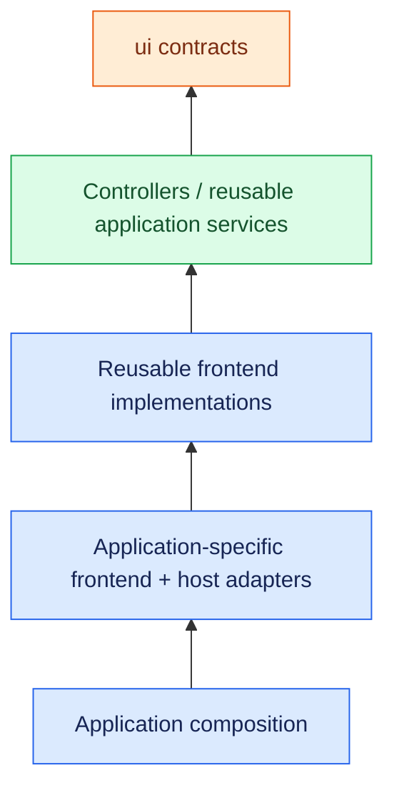
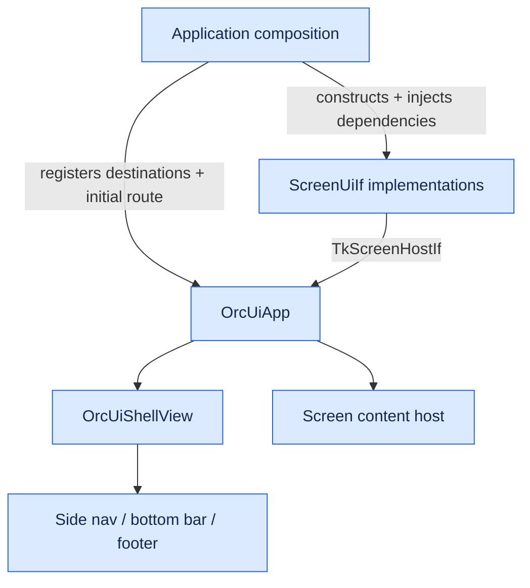

# orcUi Architecture

## Purpose

`apps/orcUi` is the application assembly and runtime layer for the integrated OpenRoadCode UI. It also owns presentation that is specific to the orcUi application itself.

OpenRoadCode deliberately separates semantic UI contracts, reusable behavior, reusable frontend rendering, application-specific presentation, host/platform adapters, and application composition so that a feature can be presented by Tk, web, Android, or another frontend without moving its controller logic into the application shell.

## Dependency boundaries

`ui/` is the toolkit-independent semantic boundary. Contracts there describe user intent, presentation state, semantic identifiers, and narrow frontend-facing behavior. Code in `ui/` must not depend on Tkinter, application composition, transport implementations, controllers, or hardware implementations.

`controllers/` owns reusable behavior and integration logic. Long-lived workers, state synchronization, protocol behavior, playback coordination, and similar reusable behavior do not belong in `orcUi` or in a concrete frontend.

`frontends/<frontend>/` owns reusable concrete presentation for a toolkit or delivery surface. For Tk specifically, `frontends/tk` is the reusable Tk ecosystem. Feature packages such as `frontends/tk/media`, `frontends/tk/radio`, `frontends/tk/automotive`, and `frontends/tk/games` should depend on narrow contracts rather than on one application shell.

`apps/orcUi/frontend/tk` owns the integrated orcUi Tk root window, shell chrome, HOME layout, context rail, structural navigation/vehicle/off-road panels, power dialog, and other Tk presentation that exists specifically because of the orcUi application layout.

`apps/orcUi/adapters` owns ORC-selected host/platform bridges. These include browser lifecycle adaptation, the local Spotify Web Playback host, and ADS-B launcher/config adaptation. They may know about launchers, local services, protocols, configuration, and host details. Reusable controllers and reusable frontend packages must not know about them.

`apps/orcUi` also owns assembly, application-specific runtime adapters, presenters used by the assembly, and resource lifecycle. Composition may select reusable frontend implementations and combine them with application-specific presentation and host adapters.

The intended direction is:

<div class="orc-diagram-legend" aria-label="Architecture diagram legend">
  <strong>Diagram key</strong>
  <span><i class="orc-legend-swatch orc-legend-app"></i>App / UI</span>
  <span><i class="orc-legend-swatch orc-legend-service"></i>Service / runtime</span>
  <span><i class="orc-legend-swatch orc-legend-controller"></i>Controller / domain</span>
  <span><i class="orc-legend-swatch orc-legend-message"></i>Messaging / contract</span>
  <span><i class="orc-legend-swatch orc-legend-adapter"></i>Protocol / hardware</span>
  <span><i class="orc-legend-swatch orc-legend-external"></i>External / input</span>
</div>


```mermaid
flowchart BT
    ui["ui contracts"]
    controllers["Controllers / reusable application services"]
    frontends["Reusable frontend implementations"]
    appFrontend["Application-specific frontend + host adapters"]
    composition["Application composition"]

    composition --> appFrontend --> frontends --> controllers --> ui

    classDef orcApp fill:#dbeafe,stroke:#2563eb,color:#172554;
    classDef orcService fill:#ede9fe,stroke:#7c3aed,color:#2e1065;
    classDef orcController fill:#dcfce7,stroke:#16a34a,color:#14532d;
    classDef orcMessage fill:#ffedd5,stroke:#ea580c,color:#7c2d12;
    classDef orcAdapter fill:#fee2e2,stroke:#dc2626,color:#7f1d1d;
    classDef orcExternal fill:#f3f4f6,stroke:#6b7280,color:#1f2937;

    class ui orcMessage;
    class controllers orcController;
    class frontends,appFrontend,composition orcApp;
```

A concrete application frontend and composition root are allowed to know which reusable frontend components and host adapters they selected. Reusable controllers, UI contracts, and reusable frontend packages must not know which application selected them.

## Entry point and assembly

`python -m apps.orcUi` enters `main.py`, which does one thing: create the application composition and run it. It does not re-export the concrete Tk shell.


```mermaid
flowchart TD
    main["apps/orcUi/main.py"] --> appComposition["composition/application.py"]

    appComposition --> runtime["OrcUiApplicationRuntime"]
    appComposition --> core["composition/core.py"]
    appComposition --> radio["composition/radio.py"]
    appComposition --> games["composition/games.py"]
    appComposition --> media["composition/media.py"]
    appComposition --> weather["composition/weather.py"]

    core --> map["MapRuntime"]
    core --> lifecycle["SystemLifecycleController"]
    core --> volume["SystemVolumeHandler"]
    core --> app["apps/orcUi/frontend/tk/OrcUiApp"]
    core --> ingress["StateIngressRuntime"]

    radio --> reusableRadio["Reusable Tk radio presentation"]
    radio --> radioShell["orcUi Tk radio shell"]
    radio --> adsb["apps/orcUi/adapters/ADS-B lifecycle"]

    games --> reusableGames["Reusable Tk games presentation"]

    media --> reusableMedia["Reusable Tk media presentation"]
    media --> browser["apps/orcUi/adapters/browser lifecycle"]
    weather --> weatherController["WeatherController / Open-Meteo"]
    weather --> weatherTk["Reusable Tk Weather presentation"]

    classDef orcApp fill:#dbeafe,stroke:#2563eb,color:#172554;
    classDef orcService fill:#ede9fe,stroke:#7c3aed,color:#2e1065;
    classDef orcController fill:#dcfce7,stroke:#16a34a,color:#14532d;
    classDef orcMessage fill:#ffedd5,stroke:#ea580c,color:#7c2d12;
    classDef orcAdapter fill:#fee2e2,stroke:#dc2626,color:#7f1d1d;
    classDef orcExternal fill:#f3f4f6,stroke:#6b7280,color:#1f2937;

    class main,appComposition,app,radioShell,reusableRadio,reusableGames,reusableMedia,weatherTk orcApp;
    class runtime,core,ingress orcService;
    class map,lifecycle,volume,weatherController orcController;
    class adsb,browser orcAdapter;
```

`OrcUiComposition` owns the top-level graph, feature catalog, navigation destinations, and shutdown order. Application/runtime objects own the resources they create. The Tk shell consumes injected runtime interfaces and semantic contracts rather than constructing backend infrastructure itself. `CoreComposition` owns `MapCameraRuntime`; application composition passes its `MapRequestHandlerIf` to the HOME and NAVIGATION screens. No process-global map-camera registry is used.

## Tk shell ownership

`apps/orcUi/frontend/tk/orc_ui_app.py` owns the concrete integrated Tk shell. It creates the Tk root, arranges shell chrome, hosts registered screens, manages generic navigation, and runs the Tk event loop. It does not own the feature catalog or choose feature destinations. Composition registers screens and navigation destinations, selects the initial destination, and supplies actions for shell controls such as Settings.

Desktop development may select an exact client size with `ORCUI_GEOMETRY`,
force or disable fullscreen with `ORCUI_FULLSCREEN`, and request an undecorated
window with `ORCUI_BORDERLESS=1`. Fullscreen takes precedence over borderless.
In borderless mode the in-shell power control remains available and Escape
restores ordinary window-manager decorations without closing ORC. For example,
`ORCUI_GEOMETRY=1280x720 ORCUI_FULLSCREEN=0 ORCUI_BORDERLESS=1 ./runOrcUi`
matches the landscape Pi Touch Display 2 layout inside a VM.

It must not create ZeroMQ subscribers, message decoders, audio backends, Spotify synchronization workers, browser lifecycle managers, external map renderer launchers, or host restart/poweroff implementations. Those dependencies are injected through application/runtime or UI contracts.

Structural orcUi widgets that are meaningful only inside that shell stay under `apps/orcUi/frontend/tk`. A widget that could reasonably be reused by another Tk application belongs in an appropriate feature package under `frontends/tk` instead.

## Screen hosting and navigation

The screen boundary follows one rule: **composition owns dependencies, screens own feature behavior, and `OrcUiApp` owns the shell**. `OrcUiApp` maintains a generic screen registry and navigation list but contains no built-in feature catalog. A new feature should be addable by composition without editing `OrcUiApp`.


```mermaid
flowchart TD
    composition["Application composition"] -->|constructs + injects dependencies| screens["ScreenUiIf implementations"]
    composition -->|registers destinations + initial route| shell["OrcUiApp"]
    screens -->|TkScreenHostIf| shell
    shell --> shellView["OrcUiShellView"]
    shellView --> chrome["Side nav / bottom bar / footer"]
    shell --> content["Screen content host"]

    classDef orcApp fill:#dbeafe,stroke:#2563eb,color:#172554;
    classDef orcMessage fill:#ffedd5,stroke:#ea580c,color:#7c2d12;
    class composition,screens,shell,shellView,chrome,content orcApp;
```

Registered screens may be visible or hidden from primary navigation. Composition may also register a destination without a screen when the integrated shell should expose a generic placeholder. The shell renders that fallback generically; it does not know which feature the destination represents.

Reusable Tk screens depend on `TkScreenHostIf`, not `OrcUiApp`. The host contract provides a content parent, screen activation and clearing, title/status updates, UI-thread scheduling, and a back-action hook. orcUi renders a dedicated Back control when the active screen supplies an action. Screen and destination transitions clear the previous action; theme rebuilds preserve the current action.

## Reusing Tk for another application

`frontends/tk` is not uniquely tailored to orcUi. A future independent Tk application owns its shell under its own application package:

```text
frontends/tk/
    automotive/
    media/
    radio/
    games/
    ... reusable Tk features ...

apps/orcUi/frontend/tk/
    orc_ui_app.py
    ... orcUi-specific layout ...

apps/alternateUi/frontend/tk/
    alternate_ui_app.py
    ... alternate-specific layout ...
```

That alternate shell can reuse the existing controllers, `ui/` contracts, and generic Tk feature packages. Reusable Tk screens use `TkScreenHostIf`, so another Tk shell can host them by implementing that narrow interface rather than inheriting from or depending on `OrcUiApp`.

If a reusable Tk component begins importing `apps.orcUi` or `apps.orcUi.frontend.tk`, that is an architecture smell. Extract the required operation into a narrow contract rather than coupling the reusable component to the orcUi shell.

## State flow

`core_runtime.py` contains shell-facing runtime adapters. `MapRuntime` owns the external map-renderer lifecycle and renderer-specific theme consequences. `StateIngressRuntime` owns message ingress, decoders, presenter invocation, and scheduling already-presented state onto the UI thread.


```mermaid
flowchart LR
    transport["Transport"] --> decoder["Decoder"] --> presenter["Presenter"] --> scheduler["UI-thread scheduler"] --> frontend["Concrete frontend"]

    classDef orcApp fill:#dbeafe,stroke:#2563eb,color:#172554;
    classDef orcService fill:#ede9fe,stroke:#7c3aed,color:#2e1065;
    classDef orcController fill:#dcfce7,stroke:#16a34a,color:#14532d;
    classDef orcMessage fill:#ffedd5,stroke:#ea580c,color:#7c2d12;
    classDef orcAdapter fill:#fee2e2,stroke:#dc2626,color:#7f1d1d;
    classDef orcExternal fill:#f3f4f6,stroke:#6b7280,color:#1f2937;

    class transport,decoder orcMessage;
    class presenter orcController;
    class scheduler,frontend orcApp;
```

Vehicle, position, and attitude remain distinct presentation states. Concrete frontend widgets receive those already-presented states. They do not decode transport payloads or assume a particular sensor implementation.

## System intent

System controls use semantic contracts from `ui.system`.

Volume requests flow through `VolumeRequestHandlerIf`; normalized volume/mute state returns through `VolumeUiIf`. `SystemVolumeHandler` translates those requests to the concrete audio controller.

Restart and poweroff requests flow through `SystemLifecycleRequestHandlerIf`. `SystemLifecycleController` records the requested action, and `OrcUiComposition` executes it only after normal resource cleanup.

## Feature composition

`composition/radio.py` wires application-owned radio services to reusable Tk radio presentation and the ORC-specific radio shell. SDR++/ADS-B presentation details stay outside the reusable radio package. ADS-B host/config lifecycle is an ORC adapter, while managed process lifetime remains explicitly owned.

`composition/media.py` wires shared Spotify services, local-player behavior, image/lyrics/video dependencies, and reusable Tk media screens. Spotify synchronization and local-player behavior remain under `controllers/spotify`; ORC-selected browser and Web Playback hosts live under `apps/orcUi/adapters`.

`composition/music_visualizer.py` selects capture backends and visualizer hosts. Media composition embeds the shared browser WebGL renderer through the reusable `BrowserMediaScreen` and the ORC-selected `MusicVisualizerBrowser` adapter. The adapter owns a loopback HTTP host and Chromium lifecycle; shared `MusicAnalysisSession` owns capture and FFT analysis. Composition owns shutdown. The optional Tk fallback injects `MusicVisualizerControlIf` into reusable Tk presentation and uses `MusicVisualizerController` for background work. Semantic sources and frames live under `ui/music_visualizer`; HTTP routes and WebGL assets live under `frontends/web/audio_analysis`. Neither frontend imports application composition or chooses capture infrastructure.

`composition/games.py` constructs the catalog, installers, process launcher,
X11 adapter, and `GamesSession`, then supplies the session to `GamesScreen`.
The screen consumes `GamesSessionIf`; inventory uses `GamesUiIf` and semantic
`GamesRequestHandlerIf` requests. `GamesRuntimeUiIf` exposes only native host
creation, loading presentation, and restoration of inventory. Its opaque host
handle and pixel dimensions are platform rendering values, not vehicle SI state.

`GamesSession` owns the inventory controller and worker orchestration. It consumes
`GameLauncherIf` (including backend command overrides, process identifiers, and
exit notifications) and the narrow `GameWindowEmbedderIf` platform contract.
The concrete X11 adapter is supplied by composition; controllers do not import
frontends. Native embedding, resizing, and cleanup share a lock so cleanup cannot
clear an adapter while embedding is in flight. The frontend debounces resize
notifications and the session performs native resizing on a worker.

Hiding detaches the inventory handler, retires the view binding, and invalidates
pending launch completions before scheduling native cleanup. Reopening creates
a fresh inventory controller; old inventory and process callbacks cannot publish
to it. New launches wait until native cleanup has completed. Shutdown is
idempotent and attempts both launcher and adapter cleanup even if one fails.
Composition rolls back the session if screen creation or registration fails.
Native discovery remains bounded by the platform adapter timeout; hiding does
not interrupt an already executing native command, and shutdown waits for the
serialized operation to release its lock. Games widgets may not import backend,
application, worker, or X11 adapter dependencies; the boundary gate locks in this
migration with seven legacy exceptions removed.

`composition/weather.py` wires the provider-independent Weather controller to the reusable Tk Weather screen. The current composition selects Open-Meteo, resolves location through GPSD with the configured navigation fallback, supplies the shared global unit preference, and connects the semantic NOAA Weather Radio action to the existing radio composition. Forecast domain state remains SI; display conversion stays at presentation boundaries. Weather alert ingress is independent of forecast refresh: `StateIngressRuntime` decodes `weather.alert` messages, `WeatherAlertPresenter` updates `OrcUiPresentationState`, and the shell observes that state to render persistent alert chrome without moving Weather feature ownership into `OrcUiApp`.

New features should follow the same sequence: define semantic contracts, implement reusable behavior, implement reusable presentation per frontend where appropriate, add application-specific presentation or host adapters only when necessary, then assemble concrete choices at the application composition edge.

## Theme ownership

`theme_runtime.py` resolves `ThemeBundle` values from the shared CSS-derived theme model. Concrete frontends paint those values. Runtime-specific consequences, such as installing a MapLibre style, belong to the runtime that owns that renderer rather than to the shell.

Semantic theme intent may originate from the active application shell. Provider-specific brand colors are allowed where intentional, but application chrome should continue to come from the shared theme model.

## Lifecycle

A resource has one clear owner. The object that creates a process, worker, subscriber, browser host, or other managed resource must expose and own its cleanup behavior.

`OrcUiComposition.run()` starts the assembled graph, runs the selected frontend, then closes games/media/core/application resources in defined order before executing any deferred host lifecycle action.

Do not add independent shutdown paths inside feature screens merely because reaching `subprocess` from a button is temptingly easy.

## Developer verification

From the repository root, run the focused suites relevant to the changed ownership:

```bash
python -m unittest discover -s apps/orcUi/composition/unit_test -p 'test_*.py'
python -m unittest discover -s controllers/system/unit_test -p 'test_*.py'
python -m unittest discover -s controllers/audio/unit_test -p 'test_*.py'
python -m unittest discover -s controllers/spotify/unit_test -p 'test_*.py'
python -m unittest discover -s controllers/application_runtime/unit_test -p 'test_*.py'
python -m unittest discover -s controllers/games/unit_test -p 'test_*.py'
python -m unittest discover -s ui/unit_test -p 'test_*.py'
python -m unittest discover -s frontends/tk/unit_test -p 'test_*.py'
python -m unittest discover -s apps/orcUi/frontend/tk/unit_test -p 'test_*.py'
python -m unittest discover -s frontends/tk/media/unit_test -p 'test_*.py'
python -m unittest discover -s frontends/tk/radio/unit_test -p 'test_*.py'
python -m unittest discover -s frontends/x11/unit_test -p 'test_*.py'
python -m apps.orcUi
```

These tests do not replace an X11 integration smoke test. On Termux/X11, exercise HOME, NAVIGATION/map, VEHICLE, OFF-ROAD state, MEDIA/Spotify, RADIO embedding, GAMES embedding, volume, theme changes, restart, and shutdown.

Before merging a substantial architecture change, review the complete branch diff for stale paths or accidental product behavior changes, run repository quality checks, and perform the GUI smoke test.

## Maintenance rules

- Keep `apps/orcUi/main.py` as a thin composition entry point.
- Keep concrete dependency construction in composition/runtime factories.
- Keep the feature catalog, initial destination, and feature-specific shell actions in composition rather than `OrcUiApp` or `OrcUiShellView`.
- A new screen or primary destination should be addable without modifying `OrcUiApp`.
- Keep reusable Tk rendering under `frontends/tk`.
- Keep orcUi-specific Tk rendering and layout under `apps/orcUi/frontend/tk`.
- Keep ORC-selected host/platform bridges under `apps/orcUi/adapters`.
- Keep reusable Tk features independent of `OrcUiApp`, `apps/orcUi/frontend/tk`, and app adapters.
- Prefer `TkScreenHostIf` or another narrow contract when reusable Tk presentation needs host services.
- Keep transport decoding and backend resource ownership outside concrete frontend widgets.
- Keep shared icons semantic and frontend rendering local.
- Keep theme values sourced from the shared theme model except deliberate provider branding.
- Remove obsolete compatibility aliases when ownership changes instead of preserving architectural ambiguity indefinitely.

## POI actions and connectivity

### Strict contract type checking

`scripts/check_ui_types.py` runs pinned mypy in strict mode using the scope in
`pyproject.toml`. The scope covers the widget marker, dispatcher and
routing contracts, the route stub and service adapter, the callback queue,
the ORC shell, and Games contracts, controller, launcher, session, Tk presentation,
and composition, plus the migrated streaming-radio contracts, orchestration,
Tk presentation, and composition. Route request interface files are selected by a
glob so additional route capabilities enter the check automatically.

`scripts/ui_type_witnesses.py` statically checks the shell against `UiDispatcherIf`
and `TkScreenHostIf`, and Games session, runtime surface, and X11 adapter against
their narrow contracts, as well as radio browser, playback source, and storage
bindings, without constructing frontend or backend resources. Tests
exercise the actual mypy configuration with invalid overrides, obsolete argument
lists, incorrect argument types, and an incompatible structural dispatcher.

Imported legacy modules retain their type information through
`follow_imports = "silent"`, while diagnostics focus on the selected files. This
does not yet type-check every widget or every composition caller. Expand the
explicit scope as those features are migrated; do not use blanket missing-import
ignores, skipped imports, or relaxed settings to conceal contract errors. Existing
behavioral tests still verify thread delivery, late completion rejection, and
cleanup semantics that a static checker cannot prove.

Install development tools from `requirements-dev.txt`. The type check is required
by the local quality gate and CI, and missing mypy is a failure. Runtime installers
remain independent of development tooling.

### Automotive gauge theme ownership

Immutable vehicle-gauge and redline theme values, including the shared defaults,
live under `ui/theme/vehicle_gauges.py` and are exported by `ui.theme`. Automotive
widgets consume these values directly; CSS-to-gauge theme resolution remains in
the reusable Tk automotive frontend. Colors, fonts, and redline geometry are
unchanged. Application composition may supply a custom style through the existing
widget parameters.

The old `apps.common.uiTheme` gauge exports and module have been removed. Callers
import from `ui.theme` or `ui.theme.vehicle_gauges`. The boundary gate now rejects
all `apps` imports under `frontends/tk/automotive`, including nested new modules,
so reusable automotive presentation cannot regain application ownership coupling.

### Widget policy marker

`ui.UiWidget` is a toolkit-independent, behavior-free marker for presentation
objects. It has no constructor, lifecycle methods, dependency container, or
registration mechanism. `ScreenUiIf` inherits it, so `TkScreen` implementations
carry the policy automatically. Standalone panels can mix it into their existing
toolkit class. Active shared Tk widgets, ORC panels and composite presentation
objects, and shared instrument widgets now carry the marker. Their constructors
and toolkit bases remain unchanged. A migration coverage test imports concrete
toolkit classes without constructing a display and checks their inheritance;
new direct Tk widgets in these scopes are included automatically.
Older application frontends and deprecated UI remain outside this migration.
The concrete rendering can use Tk;
portable state, presentation interfaces, and semantic request interfaces stay
under `ui/`.

Marked objects receive already constructed contracts. They do not choose backend
implementations, resolve services, or assemble dependency graphs. Those operations
belong to composition. The marker does not prevent constructor injection of a
request-handler interface.

The project-wide boundary gate statically discovers top-level marked classes and
their subclasses across repository source modules. Import aliases, relative
imports, and explicit re-exports preserve discovery. Marked modules are checked
under the existing dependency rules even outside frontend directories. Discovery
does not import application code or initialize a GUI. Directory checks remain
active without the marker, and the existing legacy exception counts cannot grow.
Dynamic class factories/computed imports are outside this static discovery's
scope. The marker adds policy coverage, not proof of runtime behavior or signature
compatibility; those still require type checks and behavioral contract tests.

### Routing capabilities

`RouteRequestHandlerIf` provides single-destination start and cancel. Starting a
route accepts `destination` and `travel_mode`; the unused `waypoints` argument
has been removed. `RouteRequestHandlerStub` implements only this baseline.
`NavigationRouteRequestHandler` additionally implements
`RouteSimulationRequestHandlerIf`, matching the navigation service's commands.

Advanced behavior is independently extensible through abstract interfaces under
`ui/navigation`: `RouteWaypointRequestHandlerIf`,
`RouteAlternativeRequestHandlerIf`, `RouteRecalculationRequestHandlerIf`,
`RouteTravelModeRequestHandlerIf`, and `RouteVoiceGuidanceRequestHandlerIf`.
Frontends discover support with `isinstance(handler, CapabilityIf)` before showing
the associated controls. An adapter must inherit an optional interface only when
it implements that behavior. The current service adapter implements none of these
advanced capabilities; it no longer exposes unsupported operations or silent
local settings. Initial route costing remains part of baseline start.
The baseline exposes immutable `supported_travel_modes` for mode selectors.
The current adapter supports auto, bicycle, and pedestrian routes; transit is
rejected with `ValueError` before contacting the service. The UI travel-mode
enum remains provider-neutral so a future adapter can implement transit.

Waypoint-capable implementations provide `request_start_route_with_waypoints`
alongside editing requests. Existing baseline callers migrate from
`request_start_route(destination, (), travel_mode)` to
`request_start_route(destination, travel_mode)`. A caller that supplies intermediate
locations must first require `RouteWaypointRequestHandlerIf`, then call its
dedicated start method. Simulation remains an independent existing capability.

### Resource ownership and frontend dispatch

Composition factories register cleanup as soon as they acquire an owned resource.
`ResourceCleanup` rolls back partial startup in reverse acquisition order and
preserves the startup exception, attaching any cleanup failures as notes. Successful
factories transfer ownership to their composition. Composition shutdown is
idempotent and attempts every owned cleanup before reporting failures. The shell
closes its delivery queue before feature and runtime resources are released.

`UiDispatcherIf.dispatch_ui` accepts worker completions through a thread-safe
queue without calling Tk. The shell drains bounded batches on the frontend thread.
Closing retires that queue, discarding pending and late completions. Delayed
`schedule_ui_callback` and cancellation remain frontend-thread operations; worker
code uses `dispatch_ui`. Weather controllers and Games use that delivery contract.
Controller generation checks still reject stale results while the application is
open. Shell shutdown cancels tracked timers and attempts screen, chrome, and root
cleanup even when an earlier cleanup fails.

`frontend/tk/navigation_panel.py` owns navigation state and UI polling. Its
`navigation_poi_actions.py` helper owns asynchronous app/web handoffs, duplicate
launch suppression, and applying queued results on the Tk thread. Failed handoffs
leave the card open for retry; a completed launch does not close a newer card.
Platform routing remains in `AndroidAppLauncher` and its Bridge, Waydroid, and
desktop-browser adapters; provider metadata stays in the POI catalogs.

`OnlineModeController` combines the manual preference with observed reachability
and persists the effective mode for background services. `NetworkMonitor` reads
Android Bridge locally on Termux and receives NetworkManager events through
nmcli on Linux. The shell applies queued observations on the UI thread and
invalidates older internet-check results. Feature compositions subscribe to the
same mode to disable online actions while preserving local map, navigation, RF,
and visualizer capabilities. See [the online/offline guide](../../docs/online_offline_mode.md)
and [POI ordering](../../docs/poi_ordering.md) for behavior and testing.

### Integration of camera feedback and connectivity

The composition root owns `ShellConnectivityController`, including network
monitoring, reachability workers and stale probe invalidation. Frontends receive
`OnlineModeIf` for presentation and emit the shell toggle through a bound request.
Weather mode transitions are owned by `WeatherScreenController`: going offline
invalidates pending work while retaining cached forecast state; reconnecting
forces a refresh.

Navigation places sessions convert renderer camera events to immutable SI
`NavigationCameraState`, notify the shared map handler without a feedback command,
and expose snapshots through the places contract. POI action workers live in
`NavigationPlacesController`; widgets retain a request identity and popup identity
so a late successful handoff cannot close a replacement popup. Closed sessions
discard completions. Canonical POI values include the validated website as well
as missing-index error reporting. Platform launchers are injected by composition.

Termux updates retain `--renderer-only` and the configurable renderer build
directory. Full navigation updates always rebuild the ORC-owned renderer, while
MapLibre retains its build-state checks.

### Streaming radio ownership

`composition/radio.py` constructs the directory, favorites store, native embedder,
and streaming browser sessions. `RadioEntryPanel` receives a presentation factory
and does not receive streaming services. `RadioScreen` receives its native adapter
from composition. Each browser consumes `StreamingRadioSessionIf` for lifecycle
and emits `StreamingRadioRequestHandlerIf` requests using displayed station IDs.
`StreamingRadioUiIf` accepts immutable `StreamingRadioBrowserState` plus encoded
artwork bytes; widgets create Pillow/Tk display images on the frontend thread.
`PersistentStreamingRadioPanel` now adds theme presentation only. Shared immutable
filter selections and classification helpers live under `ui/radio/station_filters.py`;
the old controller module reexports them for existing consumers.

`StreamingRadioBrowser` owns directory queries, favorite persistence, playback
requests, artwork caching, and stale-result checks. Composition owns separate
bounded worker pools for browser operations and artwork so downloading station
logos cannot queue playback behind a backlog of images. Workers deliver through
`dispatch_ui`; they never call Tk scheduling or inspect widget lifetime. Local
and regional search policy, stable favorite IDs and ordering, and presentation
filters retain their existing behavior. Directory completion checks both the
visible session generation and the latest requested mode. Favorite writes are
serialized by the store, and failed persistence leaves membership unchanged.

Leaving the browser retires its handler and pending deliveries. Queued playback
that has not begun is discarded; audio already in progress remains application-owned
and continues across navigation. Opening the browser refreshes current metadata
and playback state. Artwork is deduplicated within a visible session and cached
by station ID and artwork URL; URL changes invalidate older images. Missing or
corrupt artwork retains the placeholder. Downloads retain the five-second timeout
and two-MiB encoded payload limit. In-flight directory and artwork transport may
finish after hide/close, but its results cannot reach the retired presentation.

Home consumes `StreamingRadioStateSourceIf.snapshot()`, not a concrete playback
service. `StreamingRadioController` serializes native play/stop operations and
supplies a consistent immutable playback snapshot. Reading that snapshot never
waits for a native operation. Runtime shutdown uses terminal `close()`: it retires
new playback before waiting for native cleanup, preventing delayed workers from
restarting audio after shutdown. Radio composition closes browser sessions,
unsubscribes its online listener, cancels its ADS-B status timer, and retires both
worker pools; application composition owns that cleanup and startup rollback.

Strict mypy includes the streaming contracts, controller, browser, transport,
Tk browser/theme/Home widgets, radio screen, and composition. Structural witnesses
check actual implementations against their contracts. The migrated streaming
frontends have no backend import exceptions; thirteen prior exceptions are removed.
RF profile/telemetry orchestration and the chooser's SDR launch worker remain a
separate migration and keep their existing exact legacy exceptions.

### Spotify presentation and browsing

Spotify views render immutable media/library state and emit semantic requests.
`SpotifyPresentation` and `SpotifyBrowser` own polling, workers, cache access,
video/lyrics behavior, destination selection, and stale completion guards.
Composition constructs and closes sessions, worker pools, and native adapters;
Tk owns encoded artwork decoding and native host rendering. See
[Spotify UI ownership](../../docs/spotify_ui.md) for lifecycle and device acceptance.
