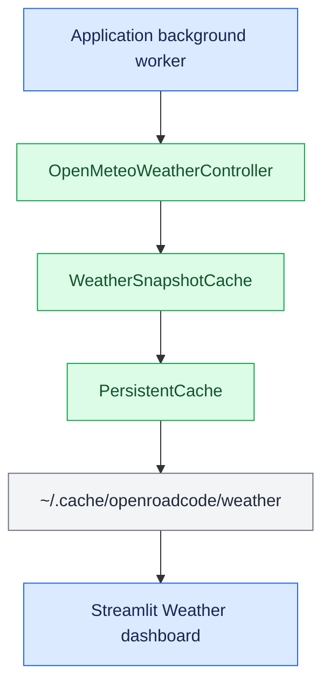

# OpenRoadCode Weather Dashboard

The Weather dashboard is a standalone Streamlit frontend for cached
Open-Meteo forecast data. CarUi can launch it from the Weather screen, but the
dashboard remains independently runnable.

## Architecture

The dashboard contains presentation logic only. Weather retrieval and
persistence live under `controllers/weather`, with atomic byte storage supplied
by `controllers/cache`.

<aside class="orc-diagram-legend" aria-label="Architecture diagram legend">
  <strong>Diagram key</strong>
  <span><i class="orc-legend-swatch orc-legend-app"></i>App / UI</span>
  <span><i class="orc-legend-swatch orc-legend-service"></i>Service / runtime</span>
  <span><i class="orc-legend-swatch orc-legend-controller"></i>Controller / domain</span>
  <span><i class="orc-legend-swatch orc-legend-message"></i>Messaging / contract</span>
  <span><i class="orc-legend-swatch orc-legend-adapter"></i>Protocol / hardware</span>
  <span><i class="orc-legend-swatch orc-legend-external"></i>External / input</span>
</aside>



After CarUi becomes ready, it can warm the Streamlit server and refresh the
weather snapshot in daemon workers. Opening the dashboard then renders the
cached snapshot before any stale-data refresh is needed.

## Location selection

CarUi selects weather coordinates in this order:

1. A live GPSD fix.
2. A recent last-known position from the configured position cache.
3. The weather controller's configured fallback coordinates.

Reverse geocoding is intentionally excluded from the launch path. GPS and
last-known locations are displayed as coordinates, avoiding a slow external
lookup and allowing startup when that service is unavailable.

## Freshness and offline behavior

The default weather freshness interval is 120 seconds. When cached data is
fresh, the dashboard performs no forecast request. When it is stale, the
controller requests Open-Meteo data and atomically replaces the snapshot.

If a refresh fails and an older snapshot exists, the dashboard renders the
last successful forecast and retains its original update time. If no cached
snapshot exists, the initial dashboard session must retrieve one before it can
render weather data.

## CarUi configuration

Enable the dashboard and background server warm-up in `config/runtime.toml`:

```toml
[auxiliary.weather_dashboard]
enabled = true
preload = true
```

The dashboard browser uses `runtime.auxiliary_display`, which defaults to
`:0`. Override the display for one CarUi launch with:

```bash
CARUI_AUXILIARY_DISPLAY=:2 venv/bin/python -m apps.carUi.main
```

The last-known position used by Weather is configured separately:

```toml
[position_cache]
enabled = true
directory = "~/.cache/openroadcode/position"
max_age_seconds = 604800
```

## Standalone launch

From the repository root:

```bash
venv/bin/streamlit run apps/weatherDash/main.py \
  --server.headless true \
  --server.port 8501
```

Alternatively:

```bash
apps/weatherDash/run_weather_dash.sh
```

Then open `http://127.0.0.1:8501`.

The standalone dashboard uses these optional environment variables:

| Variable | Default | Purpose |
|---|---|---|
| `OPENROAD_WEATHER_CACHE_DIRECTORY` | `~/.cache/openroadcode/weather` | Shared forecast snapshot directory |
| `OPENROAD_WEATHER_REFRESH_SECONDS` | `120` | Maximum snapshot age before refresh |

When run without CarUi, the first session refreshes the snapshot itself. A
subsequent launch can reuse the persisted data.

## Logs

CarUi-managed processes write to:

```text
~/.cache/openroadcode/tmp/weather-dashboard.log
~/.cache/openroadcode/tmp/weather-dashboard-browser.log
```

## Dependencies

The dashboard requires Streamlit, `streamlit-autorefresh`, and Requests. CarUi
launches it with the active Python environment, so dependencies should be
installed into the same environment used to run OpenRoadCode.
