# Environmental Controllers

Environmental controllers normalize physical sensor data into application-facing state without tying applications to a particular hardware source.

## Ambient Light

`AmbientLightController` reports ambient illuminance in lux through the hardware-independent `AmbientLightSensorIf` contract.

The Android path supports both direct component testing and the streamed sensor service:

<aside class="orc-diagram-legend" aria-label="Architecture diagram legend">
  <strong>Diagram key</strong>
  <span><i class="orc-legend-swatch orc-legend-app"></i>App / UI</span>
  <span><i class="orc-legend-swatch orc-legend-service"></i>Service / runtime</span>
  <span><i class="orc-legend-swatch orc-legend-controller"></i>Controller / domain</span>
  <span><i class="orc-legend-swatch orc-legend-message"></i>Messaging / contract</span>
  <span><i class="orc-legend-swatch orc-legend-adapter"></i>Protocol / hardware</span>
  <span><i class="orc-legend-swatch orc-legend-external"></i>External / input</span>
</aside>



```mermaid
flowchart LR
    sensor["Android TYPE_LIGHT"] --> bridge["Android sensor bridge"] --> client["AndroidSensorBridgeClient"]
    client --> buffered["BufferedAmbientLightSensor"] --> controller["AmbientLightController"] --> topic["openroad.environmental.ambient_light"]

    classDef orcApp fill:#dbeafe,stroke:#2563eb,color:#172554;
    classDef orcService fill:#ede9fe,stroke:#7c3aed,color:#2e1065;
    classDef orcController fill:#dcfce7,stroke:#16a34a,color:#14532d;
    classDef orcMessage fill:#ffedd5,stroke:#ea580c,color:#7c2d12;
    classDef orcAdapter fill:#fee2e2,stroke:#dc2626,color:#7f1d1d;
    classDef orcExternal fill:#f3f4f6,stroke:#6b7280,color:#1f2937;
    class sensor,bridge orcExternal;
    class client,buffered orcAdapter;
    class controller orcController;
    class topic orcMessage;
```

The buffered sensor lets `AndroidSensorService` feed values already received on `/stream/imu` through the controller without making a second HTTP request for every light sample.

Run the direct Android adapter/controller component test from this branch:

```bash
cd ~/src/OpenRoadCode
git switch android-ambient-light
git pull
python -m controllers.environmental.component_test.ambient_light_cli
```

To read a phone bridge from another ORC machine, enable Remote Sensor Access in the Android bridge app and provide its address:

```bash
cd ~/src/OpenRoadCode
git switch android-ambient-light
git pull
python -m controllers.environmental.component_test.ambient_light_cli \
    --url http://PHONE_IP:8766
```

Use `--once` to read a single sample. Zero lux is a valid reading; negative and non-finite values are rejected.

## Barometric Controller

The barometric controller converts normalized pressure and temperature samples into absolute altitude, relative altitude, and filtered vertical speed.

### Architecture

- `BarometricControllerIf` is the application-facing controller contract.
- `BarometricSourceIf` is the controller-facing sensor contract.
- `Bmp3xxBarometricAdapter` adapts either a BMP388 or BMP390 hardware device to normalized `BarometricSample` values.
- `BarometricController` processes those samples into `BarometricState`.
- `BarometricControllerStub` supplies deterministic state for demos.
- `UnconfiguredBarometricController` explicitly reports unavailable support.

### Component Test

Run the complete BMP3XX adapter and controller path:

```bash
python3 -m controllers.environmental.component_test.barometric_cli
```

Read one sample, select address `0x76`, or use imperial display units:

```bash
python3 -m controllers.environmental.component_test.barometric_cli \
    --address 0x76 \
    --once \
    --imperial
```

Altitude defaults to the standard sea-level reference pressure of 101325 Pa. Use a local reference for better altitude accuracy:

```bash
python3 -m controllers.environmental.component_test.barometric_cli \
    --sea-level-pressure 100800
```
