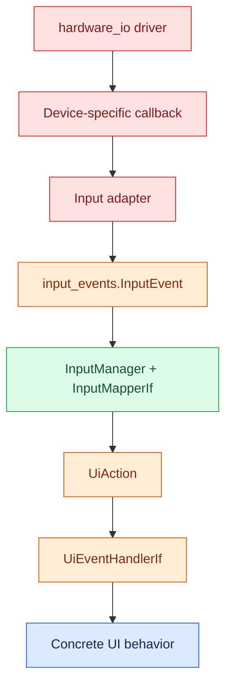

# Input Controller Layer

This package translates physical input into semantic UI actions.

## Layer boundaries

<aside class="orc-diagram-legend" aria-label="Architecture diagram legend">
  <strong>Diagram key</strong>
  <span><i class="orc-legend-swatch orc-legend-app"></i>App / UI</span>
  <span><i class="orc-legend-swatch orc-legend-service"></i>Service / runtime</span>
  <span><i class="orc-legend-swatch orc-legend-controller"></i>Controller / domain</span>
  <span><i class="orc-legend-swatch orc-legend-message"></i>Messaging / contract</span>
  <span><i class="orc-legend-swatch orc-legend-adapter"></i>Protocol / hardware</span>
  <span><i class="orc-legend-swatch orc-legend-external"></i>External / input</span>
</aside>



## Responsibilities

- `input_events` owns `InputDeviceId`, `InputEvent`, and `InputHandlerIf` as
  neutral cross-layer contracts.
- Input adapters translate device callbacks into `InputEvent`.
- `ConfigurableInputMapper` maps events to `UiAction`.
- `InputManager` delivers mapped actions to `UiEventHandlerIf`.
- The concrete UI decides how an action affects the current screen.

## Rotary encoder instances

A suggested assignment is:

- Rotary encoder instance 0: dedicated volume knob
- Rotary encoder instance 1: user-configurable knob 1
- Rotary encoder instance 2: user-configurable knob 2

The adapter does not know these meanings. Bindings assign the behavior.

## Touchscreen and mouse events

A touchscreen widget callback often already knows its semantic action. It may call:

```python
input_manager.dispatch_ui_action(UiAction.HOME)
```

Raw gestures or pointer events that require mapping can instead be represented as
generic `InputEvent` values and handled through the mapper.

New code should import physical-input contracts from `input_events`.
`controllers.input` retains compatibility exports for existing callers.
