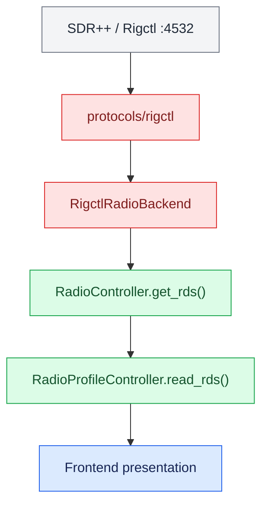

# Radio Controller

`controllers.radio` provides transport-independent radio behavior. It coordinates tuning, modes, presets, frequency ranges, selectable radio profiles, and radio-specific metadata without depending on a particular frontend.

## Package Layout

```text
controllers/radio/
├── radio_backend_if.py
├── radio_controller.py
├── radio_controller_if.py
├── radio_controller_stub.py
├── radio_input_adapter_if.py
├── radio_profile_controller.py
├── radio_profiles.py
├── radio_types.py
├── unconfigured_radio_controller.py
├── adapters/
│   ├── keyboard_radio_adapter.py
│   └── rigctl_radio_backend.py
├── component_test/
└── integration_test/
```

## Responsibilities

The package owns radio-domain behavior:

- Current frequency and demodulation mode
- Frequency stepping and configured range wrapping
- Preset selection and wraparound
- Config-driven radio profile selection
- Persistent user preset overlays
- Controller-facing backend contracts
- Input-to-controller mappings
- Adaptation of Rigctl to the radio backend contract
- Access to radio-specific metadata such as RDS when the backend supports it

Protocol packages own command formatting, socket communication, and response parsing. `controllers/sdr` owns SDR++ application control and SDR telemetry. Frontends own presentation and user interaction.

## Radio Profiles

`RadioProfileCatalog` loads shipped profiles from `config/radio/common` and the configured locale directory, currently defaulting to `config/radio/romeo`. Locale profiles override common profiles with the same key.

User-created presets are stored separately from repository configuration so normal UI edits never mutate shipped JSON files.

`RadioProfileController` composes a `RadioController` for the active profile and provides profile/preset operations to frontends.

## RDS

RDS is radio metadata and belongs in the radio path rather than the generic SDR++ telemetry protocol.

The current ORC path is:



RDS should be requested asynchronously by graphical frontends. Reading ordinary controller state must not cause hidden network I/O.

For ORCui, an FM-only RDS overlay over the embedded SDR++ view is a natural presentation. The overlay should be visible only for WFM/FM profiles and can eventually present Program Service/station identity and RadioText independently if the backend exposes structured RDS fields.

## SDR++ Services

ORC intentionally separates SDR++ integration by responsibility:

```text
4532  Rigctl          RF tuning, modes, bandwidth, radio-specific metadata
4533  remote_control SDR++ application/UI controls
4534  telemetry      read-only SDR++ runtime measurements
```

See `development/sdrpp/README.md` for the module architecture.

## Basic Use

```python
from controllers.radio import RadioController, RadioMode, RadioPreset, RadioRange
from controllers.radio.adapters.rigctl_radio_backend import RigctlRadioBackend
from protocols.rigctl import RigctlClient

wide_fm = RadioMode(name="WFM", bandwidth=180_000, step_hz=100_000)

controller = RadioController(
    backend=RigctlRadioBackend(RigctlClient("127.0.0.1", 4532)),
    presets=[
        RadioPreset("88.7 FM", 88_700_000, wide_fm),
        RadioPreset("101.1 FM", 101_100_000, wide_fm),
    ],
    default_mode=wide_fm,
    radio_range=RadioRange(
        min_frequency_hz=87_500_000,
        max_frequency_hz=108_000_000,
        start_frequency_hz=88_100_000,
    ),
)

controller.start()
controller.frequency_up()
controller.next_preset()
controller.stop()
```

## Tests

Run the deterministic component test from the repository root:

```bash
python3 -m controllers.radio.component_test
```

The SDR++ Rigctl integration test connects to a real Rigctl server:

```bash
python3 -m controllers.radio.integration_test.test_sdrpp_rigctl
```

The default endpoint is `127.0.0.1:4532`. SDR++ must have its Rigctl Server module enabled.

## Import Boundaries

Core users should depend on controller interfaces/types. Concrete transport adapters are imported explicitly:

```python
from controllers.radio.adapters.rigctl_radio_backend import RigctlRadioBackend
from controllers.radio.adapters.keyboard_radio_adapter import KeyboardRadioAdapter
```

This prevents optional transport dependencies from leaking into unrelated applications.
