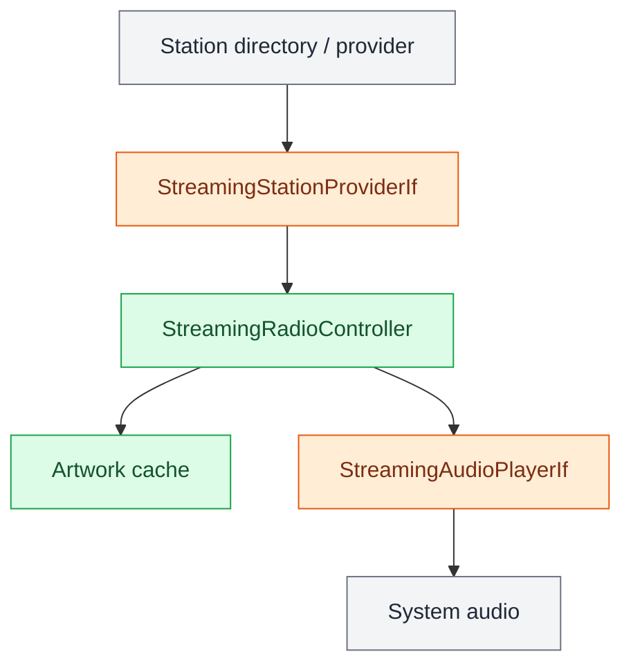

# Streaming Radio

This package owns the application-facing internet-radio behavior for OpenRoadCode.

The radio UI should not know which public directory discovered a station or which
local media engine decodes its stream. `StreamingRadioController` sits between
those concerns.

## Flow

<aside class="orc-diagram-legend" aria-label="Architecture diagram legend">
  <strong>Diagram key</strong>
  <i class="orc-legend-swatch orc-legend-app"></i>App / UI
  <i class="orc-legend-swatch orc-legend-service"></i>Service / runtime
  <i class="orc-legend-swatch orc-legend-controller"></i>Controller / domain
  <i class="orc-legend-swatch orc-legend-message"></i>Messaging / contract
  <i class="orc-legend-swatch orc-legend-adapter"></i>Protocol / hardware
  <i class="orc-legend-swatch orc-legend-external"></i>External / input
</aside>

`StreamingStation` is the provider-independent station record used by frontends.
Artwork is cached below the XDG cache root at
`openroadcode/streaming_radio/images` so a station grid does not repeatedly fetch
logos while driving.

The first provider implementation is expected to use an internet radio directory
for regional discovery. Provider-specific HTTP and JSON belong under `protocols/`,
not in this controller package.

The first orcUi radio screen presents two launch choices: RF Radio and Streaming
Radio. RF owns SDR++/Rigctl/telemetry. Streaming Radio owns internet discovery,
station artwork, and stream playback. Shared station/favorite concepts can be
introduced above these two transports later without coupling them now.
