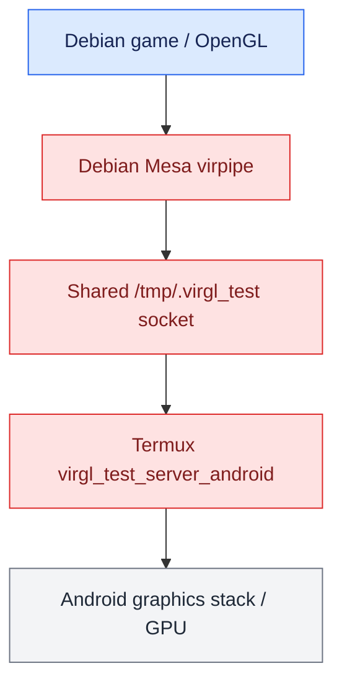
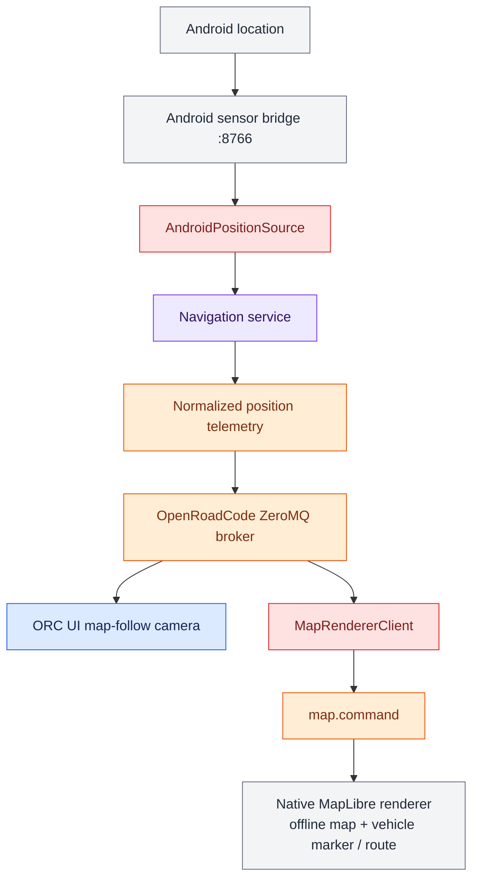

# OpenRoadCode Termux Target

This directory contains the native Termux build workflow used to exercise OpenRoadCode directly on Android hardware.

The current target combines:

- the OpenRoadCode Android sensor bridge on localhost port `8766`;
- native Python controllers and services running in Termux;
- the OpenRoadCode ZeroMQ broker, navigation service, and simulated ADS-B web presentation under runit supervision;
- Android-backed geographic position through the sensor bridge;
- simulated IMU input in the current Termux navigation profile;
- native Valhalla and MapLibre builds;
- Termux:X11 for graphical execution;
- optional native Linux games, including Debian packages hosted through `proot-distro`;
- optional hardware-accelerated graphics when a compatible Mesa backend is available; and
- offline navigation data stored under `~/.local/share/openroadcode`.

CarUi keeps the shared runtime composition in `config/runtime.toml` and selects `config/applications.termux.toml` for Termux-specific application behavior. `config/runtime.termux.toml` is the explicit Android/Termux navigation and sensor-service profile through `OPENROAD_RUNTIME_CONFIG`.

## Graphics acceleration

Android devices do not share one GPU architecture, so OpenRoadCode does not assume a particular video driver. `development/termux/configure_graphics.sh` inspects the device and selects only a graphics backend that the installed Termux repositories can support.

Run detection without changing packages:

```bash
./development/termux/configure_graphics.sh
```

Install the packages selected for the detected device:

```bash
./development/termux/configure_graphics.sh --install
```

The first validated native Termux hardware path is Qualcomm/Adreno. On a device exposing the KGSL interface, when the Termux repository supplies `mesa-vulkan-icd-freedreno`, the selected stack is:

<div class="orc-diagram-legend" aria-label="Architecture diagram legend">
  <strong>Diagram key</strong>
  <span><i class="orc-legend-swatch orc-legend-app"></i>App / UI</span>
  <span><i class="orc-legend-swatch orc-legend-service"></i>Service / runtime</span>
  <span><i class="orc-legend-swatch orc-legend-controller"></i>Controller / domain</span>
  <span><i class="orc-legend-swatch orc-legend-message"></i>Messaging / contract</span>
  <span><i class="orc-legend-swatch orc-legend-adapter"></i>Protocol / hardware</span>
  <span><i class="orc-legend-swatch orc-legend-external"></i>External / input</span>
</div>



```mermaid
flowchart LR
    adreno["Adreno"] --> kgsl["KGSL"] --> turnip["Turnip / Freedreno"] --> vulkan["Vulkan"] --> zink["Zink"] --> opengl["OpenGL"] --> x11["Termux:X11"]

    classDef orcApp fill:#dbeafe,stroke:#2563eb,color:#172554;
    classDef orcService fill:#ede9fe,stroke:#7c3aed,color:#2e1065;
    classDef orcController fill:#dcfce7,stroke:#16a34a,color:#14532d;
    classDef orcMessage fill:#ffedd5,stroke:#ea580c,color:#7c2d12;
    classDef orcAdapter fill:#fee2e2,stroke:#dc2626,color:#7f1d1d;
    classDef orcExternal fill:#f3f4f6,stroke:#6b7280,color:#1f2937;
    class adreno,kgsl,turnip,vulkan,zink,opengl,x11 orcExternal;
```

For that native Termux backend, OpenGL applications should be launched with:

```bash
export MESA_LOADER_DRIVER_OVERRIDE=zink
```

Validate each layer independently when bringing up a new device. When the corresponding diagnostic packages are installed, useful probes are:

```bash
vulkaninfo --summary
MESA_LOADER_DRIVER_OVERRIDE=zink glxinfo -B
MESA_LOADER_DRIVER_OVERRIDE=zink glxgears
```

Do not install every Mesa Vulkan ICD indiscriminately and do not assume Freedreno on Mali, PowerVR, or other GPU families. Unknown devices retain the basic/software graphics path until a hardware backend has been validated. Application launchers should consume the selected graphics environment rather than hard-coding a GPU vendor.

Chromium launched under Termux:X11 should use `--password-store=basic` so it does not depend on a desktop password-keyring service. GPU-specific Chromium flags should remain platform/runtime configuration rather than UI code.

### Debian/proot OpenGL for games

For the native Chromium/WebGL alternative-map experiment, see
[Google Earth navigation](../../docs/google_earth_navigation.md).

Debian applications running under `proot-distro` use glibc and cannot safely load Termux/Bionic Turnip libraries directly. For graphical Debian games, OpenRoadCode instead supports Mesa `virpipe` with Termux `virglrenderer-android`:



Install the Android VirGL server package when using this path:

```bash
pkg install virglrenderer-android
```

The Debian command runner starts `virgl_test_server_android` on demand when it is installed and exposes the shared socket to Debian with `proot-distro --shared-tmp`. It sets `GALLIUM_DRIVER=virpipe` for that Debian process only. This is intentionally separate from the native Termux Zink/Turnip environment.

SuperTuxKart is configured to use its OpenGL renderer rather than Vulkan on this path. Debian Vulkan may otherwise select a software renderer even when OpenGL through VirGL is accelerated.

#### Experimental GNOME game trial

GNOME 2048, GNOME Nibbles, and GNOME Sudoku are enabled for a Termux/X11
trial. Their proot configuration uses `rendering = "auto"` and
`GSK_RENDERER=gl` to select GTK OpenGL through the same VirGL bridge. Live
device rendering, input, embedding, and exit behavior remain unverified.
GTK versions that do not use GSK may ignore this renderer setting.

On the device, switch to the branch containing this trial before pulling or
testing. Close ORC, run `./development/termux/install_games.sh`, then restart
ORC in the usual Termux/X11 session. Install each game through the Games panel
and test one at a time:

1. Start a game and check that its board renders inside ORC without a blank
   window or rendering errors.
2. Play a few moves (2048/Sudoku) or a level (Nibbles), then resize the ORC window
   and check drawing and input again.
3. Use **EXIT GAME**, relaunch, and also test closing through the game's own menu.
   Check that ORC returns to the game browser each time.

To inspect the Debian OpenGL renderer after launching a game has started the
bridge, install `mesa-utils` inside Debian if needed and run in Termux:

```bash
proot-distro login debian --shared-tmp -- env DISPLAY="$DISPLAY" \
  XDG_RUNTIME_DIR=/tmp LIBGL_ALWAYS_SOFTWARE=true GALLIUM_DRIVER=virpipe glxinfo -B
```

Record the renderer string and any game errors. `virgl` indicates the bridge;
`llvmpipe` or `softpipe` indicates software rendering. This probe alone does not
prove that an individual game uses GPU rendering or performs well.
Compare failures with the previous software configuration by setting that game's
`rendering = "software"` and `GSK_RENDERER = "cairo"` in `config/games.toml`,
then restarting ORC. Set `enabled = false` to hide a failing game again.

## Native games

The ORC UI Games panel reads `config/games.toml`, discovers installed/available packages asynchronously, and supports both Termux packages and Debian packages. Install the Termux-side game prerequisites with:

```bash
./development/termux/install_games.sh
```

The Games frontend requires `xdotool` for X11 embedding. When a Debian game is selected, the controller chooses the Debian backend without exposing whether Debian is native or hosted through `proot-distro` to the UI.

The game browser adapts its columns to the window size and font metrics.
Narrow Termux/X11 windows show one column. Each full page keeps six games;
short windows scroll vertically instead of hiding games or stretching cards.
Use **PREV/NEXT** to navigate between pages. Titles and descriptions wrap above
the action button, and installation status appears below the wrapping filters.

While a game is active, ORC replaces the category browser with an **EXIT GAME** control and reparents the game's X11 window into the Games content area. Closing a game through its own menu is also detected and returns the panel to the game browser. Window embedding is best effort because third-party games can create helper processes or reposition their own top-level windows; the X11 frontend searches the launched process tree and reasserts the ORC host geometry during startup.

## Navigation contracts

Navigation data is intentionally separated by responsibility:

- **Position** contains geographic fix information such as latitude, longitude, altitude, fix mode, satellite counts, and accuracy.
- **Ground motion** contains speed over ground, course over ground, vertical speed, and turn rate.
- **Attitude** contains heading, pitch, and roll.
- **IMU** contains acceleration and angular-velocity measurements.
- **Route guidance** contains progress and maneuver state for an active route.

Position does not conceptually own speed or course. A physical provider may deliver those values with a location sample, but normalized OpenRoadCode consumers remain insulated from the provider-specific transport.

The current Termux navigation profile uses the Android bridge as its physical position source and keeps IMU simulation available so navigation remains usable when Android motion integration is unavailable. The map consumes the normalized navigation position contract rather than talking directly to Android.

**Simulate** on an active route now generates positions inside ORC's navigation
service. The Android bridge stays on real GPS. **Stop simulation**, **End route**,
arrival, or a service restart restores normal position input. This Python change
requires restarting `openroadcode-navigation`, but no renderer rebuild. After
updating, test a short route through playback, stop, arrival, and restart; verify
that live position returns. The full native renderer/theme-toggle test and live
weather-provider probes still need device verification; CI does not prove GPU
rendering. See [Weather component probes](../../controllers/weather/README.md).

## Automotive transport on Termux

PySerial is intentionally **not** a Termux dependency. Android/Termux automotive hardware uses the Android bridge and TCP transport rather than opening a serial device directly from Termux.

The ELM327 stack keeps transport selection behind the common stream-transport interface. Physical Linux targets may select the serial backend when PySerial is installed, while Android/Termux injects the TCP transport exposed by the bridge. Importing the OBD-II controller stack or running transport-injected/simulated tests must not require PySerial merely to collect or import the modules.

For the validated KONNWEI/ELM327 Android path, the bridge exposes the Bluetooth SPP connection through localhost TCP. This keeps Bluetooth ownership in Android while OpenRoadCode consumes the same ELM327 protocol through a platform-neutral byte stream.

## Build the native navigation stack

```bash
cd ~/src/OpenRoadCode
./development/termux/build_navigation_stack.sh
```

The script installs/builds native dependencies and prints the resulting paths. Termux:X11 normally uses display `:1`; override it with `X11_DISPLAY` when needed.

## Test the Android sensor bridge

With the `openroadcode-android-bridge` application running:

```bash
curl http://127.0.0.1:8766/health
curl http://127.0.0.1:8766/location
curl http://127.0.0.1:8766/imu
```

A healthy `/location` response is consumed by `AndroidPositionSource` and published by the normal navigation service. This keeps map-follow and other consumers independent of the Android bridge API.

## Run supervised Termux services

Install Termux service supervision once:

```bash
pkg install termux-services
```

Restart the Termux shell after first installing `termux-services`, then from the repository root run:

```bash
chmod +x scripts/runit/install_termux_services.sh
./scripts/runit/install_termux_services.sh
```

Start and inspect the supervised services with:

```bash
./scripts/runit/manage_core.sh start
sv up openroadcode-adsb

./scripts/runit/manage_core.sh status
sv status openroadcode-adsb
```

Stop them with:

```bash
sv down openroadcode-adsb
./scripts/runit/manage_core.sh stop
```

The runit definitions call the same runtime wrappers used by the Linux service installation where applicable. Termux-specific service definitions live under `scripts/runit/`. Runtime-generated `supervise/` directories are state, not source, and must never be committed to the repository.

Valhalla runs as the supervised `openroadcode-valhalla` runit service when the
core stack is requested; it remains down after installation. The navigation
build installs its service definition along with the core services. The Termux
build installs it under `$PREFIX/opt/openroadcode/navigation/valhalla/bin/valhalla_service`, while deployed routing data lives under `~/.local/share/openroadcode/valhalla`.

For an existing installation, register the new service once (stop any manually launched Valhalla first):

```bash
cd ~/src/OpenRoadCode
./scripts/runit/install_termux_services.sh
sv up openroadcode-valhalla
sv status openroadcode-valhalla
```

The wrapper detects Termux, reads the installed `valhalla.json`, and writes a
prepared copy under `$PREFIX/tmp/openroadcode-valhalla`. It relocates IPC sockets,
standard routing data, optional data paths, and Linux log paths into writable
Termux locations. The downloaded source configuration stays unchanged. Run the
wrapper again after pulling new routing data; no manual JSON edits are needed.
`VALHALLA_CONFIG`, `VALHALLA_BIN`, `VALHALLA_DATA_ROOT`, and
`VALHALLA_RUNTIME_ROOT` can override the defaults. Runit owns startup, crash restarts, and shutdown; no dedicated terminal is needed.
Rotating logs for every supervised service are available under
`~/.local/state/openroadcode/log/<service>/current`.
The service-manager core start/stop operations include Valhalla.
For foreground debugging only, stop the supervised service before running
`./scripts/runtime/start_valhalla.sh`.

Verify the service with:

```bash
curl http://127.0.0.1:8002/status
```

## ADS-B / tar1090 simulation

The Termux application profile uses the ADS-B producer source `simulation`. This keeps presentation testing independent of RTL-SDR hardware and Linux `readsb`/systemd service management.

Install the tar1090 presentation files once:

```bash
cd ~/src/OpenRoadCode
./development/termux/setup_tar1090.sh
```

The setup uses the tar1090 revision pinned in
`scripts/installers/toolchain.lock`; set `TAR1090_REF` only for an intentional
test of another revision.

After `scripts/runit/install_termux_services.sh` has installed the service, `openroadcode-adsb` owns the local tar1090 web server on port `8081`.

## Native map and route presentation

The native MapLibre renderer uses offline vector tiles under `~/.local/share/openroadcode/maps/vector/openroadcode.mbtiles`. Map commands are published on the OpenRoadCode message bus using the `map.command` topic. Position telemetry and camera control remain separate so a manual pan does not move the vehicle marker.

The active navigation/map path is:



Route planning uses the local Valhalla HTTP service on port `8002`. The route-to-map component test can use the real Valhalla service while recording renderer commands:

```bash
python -m services.navigation.component_test.route_to_map_e2e_cli \
  --external-valhalla
```

To publish the resulting route to a running renderer through the normal broker path, add `--external-renderer`.

## Run ORC UI

Start Termux:X11/XFCE first. When X11 is managed by runit, do not start a duplicate server on the same display.

Then launch the ORC UI from a Termux/X11 shell with the broker and navigation service already running:

```bash
cd ~/src/OpenRoadCode
export DISPLAY=:1
export CARUI_FULLSCREEN=0
export CARUI_GEOMETRY=1024x600
python -m apps.orcUi
```

The current ORC UI navigation map supports shared camera state between Home and Navigation views, follow/recenter behavior, screen-relative panning, route overlays, live vehicle position, and focused POI categories. The Games panel can launch installed native/hosted Linux games into its X11 content host. Browser-backed launchers use the selected X11 display and Chromium is started with `--password-store=basic`.

## Navigation data

The runtime target pulls validated map/routing data from a map-build machine. The map-build machine publishes a validated dataset; the target decides when to update itself. The Termux-native target stores deployed navigation data under `~/.local/share/openroadcode`. Use `development/termux/pull_navigation_data.sh` for the Android/Termux path where applicable.

Vector-map content and routing data are generated from source datasets and should not be assumed to contain every real-world business. UI POI highlighting operates on features present in the deployed vector tiles.

## Test notes

The broad Python suite runs under Termux with platform-specific hardware tests skipped when their Linux-only dependencies are unavailable. Component tests supplement automated tests where real hardware, native services, X11, Android integration, or game packages are required.

## Updating an existing map renderer

Close ORC, then update the native renderer without rebuilding MapLibre or
Valhalla:

```bash
cd ~/src/OpenRoadCode
git switch android-linux-food-apps
git pull --ff-only origin android-linux-food-apps
./development/termux/build_navigation_stack.sh --renderer-only
./runOrcUi
```

The renderer-only option installs renderer build dependencies, including `libspdlog` for
structured logging, before compiling. It requires the existing
`apps/map_renderer/build-termux` directory configured by
`build_navigation_stack.sh`. Compilation must succeed before the installed
executable is replaced. No map-data download is needed.
