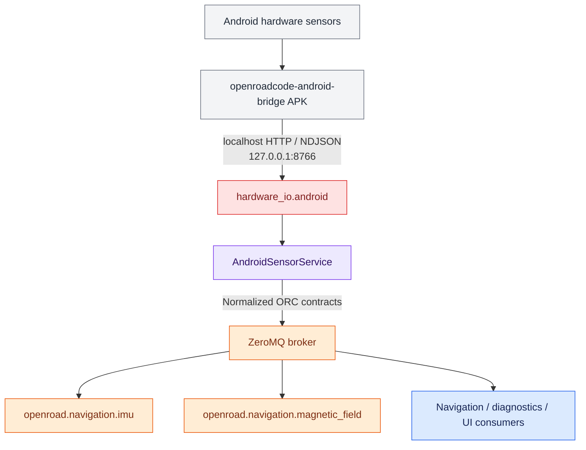

# Android Sensor Bridge Pipeline

This document describes how to build, install, run, and verify the OpenRoadCode Android sensor pipeline when OpenRoadCode runs in Termux on the same phone.

## Architecture



The APK is intentionally a hardware bridge. It does not implement OpenRoadCode navigation policy or ZeroMQ contracts. The Termux-side OpenRoadCode process owns normalization and bus publication.

## Build the Android bridge

Repository: `markisrt4/openroadcode-android-bridge`

The project targets Android API 34 and Java 17.

```bash
git clone https://github.com/markisrt4/openroadcode-android-bridge.git
cd openroadcode-android-bridge
./gradlew assembleDebug
```

The debug APK is written below:

```text
app/build/outputs/apk/debug/
```

GitHub Actions also builds a debug APK for pushes to the repository.

## Run the bridge

Install and launch `OpenRoadCode Sensor Bridge`. Start the foreground sensor service from the application UI.

The HTTP server binds only to loopback:

```text
127.0.0.1:8766
```

Useful diagnostics from Termux:

```bash
curl http://127.0.0.1:8766/health
curl http://127.0.0.1:8766/imu
curl -N http://127.0.0.1:8766/stream/imu
```

`/stream/imu` uses newline-delimited JSON and is intended for efficient continuous consumption. `/imu` is useful for snapshots and diagnostics.

## Test hardware adapters

From the OpenRoadCode repository in Termux:

```bash
python -m hardware_io.android.component_test.magnetometer_cli
python -m controllers.navigation.component_test.android_navigation_sensor_cli
```

Move and rotate the phone while the tests run. Measurements should update without requiring browser sensor APIs or Termux:API sensor polling.

## Run the ZeroMQ pipeline

Use three Termux sessions.

Session 1, broker:

```bash
python -m messaging.zeromq.broker_cli
```

Session 2, Android sensor publisher:

```bash
python -u -m services.android.android_sensor_service_cli
```

Session 3, diagnostic subscriber:

```bash
python -u -m services.android.android_sensor_subscriber_cli
```

The subscriber should report both IMU and magnetic-field messages while the phone moves.

## Bus contracts

The current Android bridge contributes to these normalized contracts:

- `openroad.navigation.imu`: accelerometer, linear acceleration, and gyroscope
- `openroad.navigation.magnetic_field`: raw three-axis magnetic field

See `docs/idd/navigation_imu_state.md` and `docs/idd/navigation_magnetic_field_state.md` for the wire-level definitions.

Pressure is exposed by the APK and hardware I/O layer but should be published through an environmental/barometric contract rather than being folded into navigation IMU data.

## Layering rules

- Android framework and localhost HTTP details belong in `hardware_io/android`.
- Hardware-independent controller interfaces belong in `controllers`.
- JSON/ZeroMQ wire contracts belong in `messaging/contracts`.
- Services compose hardware sources and publishers.
- Sensor fusion, mounting-frame correction, compass heading, and navigation policy belong above raw hardware I/O.
