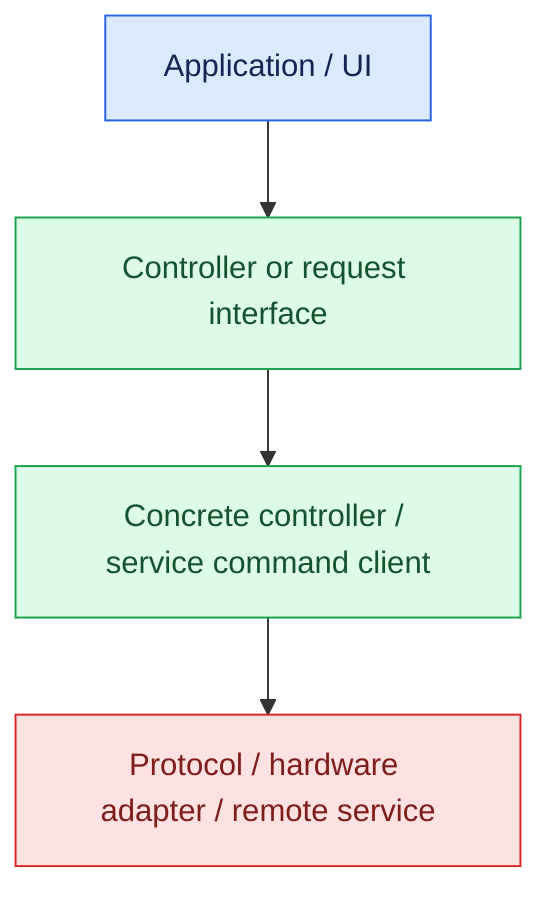
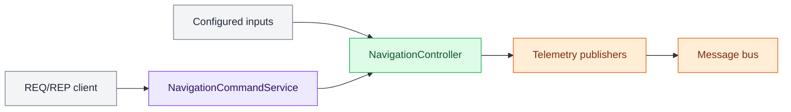
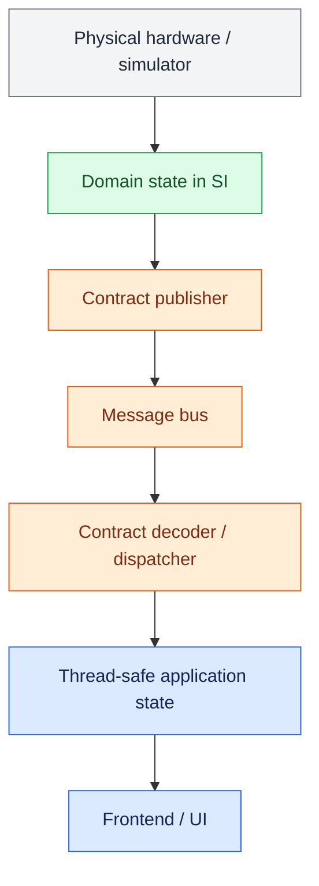
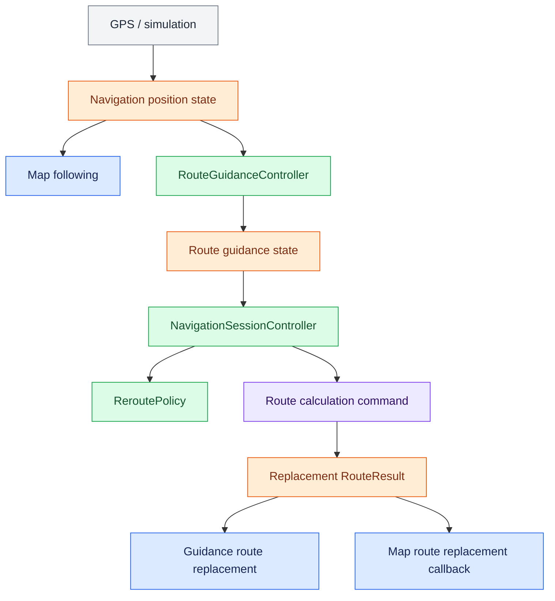
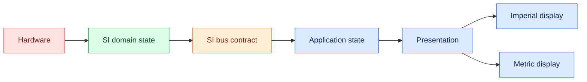

# OpenRoadCode Architecture

OpenRoadCode separates **domain behavior**, **process ownership**, **messaging**, and **presentation**. These boundaries let the same application logic run with physical hardware, simulation, remote services, or test doubles without teaching every UI how the machinery works.

## Behavior and command path

Applications use controller or request interfaces when they need behavior such as changing a radio frequency, controlling lighting, calculating a route, or requesting navigation calibration.

The architecture diagrams use a consistent layer palette: **blue** for applications/presentation, **purple** for services/runtime ownership, **green** for controllers/domain behavior, **orange** for messaging/contracts, **red** for protocol/hardware boundaries, and **gray** for external systems or inputs.

Controllers contain reusable domain behavior. A long-running service may own a controller and expose selected operations through an acknowledged command endpoint so multiple applications do not create competing hardware or service instances.

## Service ownership

`services/` owns long-running runtime composition and process lifecycle. A service is not another name for a protocol transport.

For example, the navigation service owns the active navigation controller, selected GPS/IMU sources, telemetry publication, and acknowledged navigation command handling. ZeroMQ is merely one transport used by that service.

This distinction is deliberate:

- `services/` answers **who owns and runs this domain capability?**
- `messaging/` answers **how is public state or a message transported and encoded?**

## Telemetry and state path

Continuously changing public state is distributed through the message bus instead of requiring every application to own or directly reference the producing controller.

This lets CarUI, CarTUI, WebUI, diagnostics, recorders, and future applications consume the same telemetry without coupling themselves to the hardware implementation.

A consumer should not need to know whether telemetry originated from physical hardware, a simulator, a replay process, or another computer on the vehicle network.

## Navigation stack

Navigation is intentionally split into several responsibilities rather than one controller that gradually acquires knowledge of the entire universe.

Responsibilities are:

- `controllers/route_planning/` calculates routes and owns route-domain types.
- `controllers/route_guidance/` projects positions onto an active route and derives maneuver progress, arrival, and off-route state.
- `controllers/navigation_session/` owns active-route lifecycle: destination, travel mode, reroute policy, and route replacement.
- `services/navigation/` owns the long-running navigation process and exposes acknowledged navigation/route commands.
- map presentation consumes position and route state without owning route-planning policy.

`RouteGuidanceController` reports `off_route`; it does not decide to recalculate a route. `ReroutePolicy` decides when a sustained off-route condition warrants recalculation. This prevents GPS noise from becoming route-planning policy.

## Public telemetry today

Current public bus domains include:

- vehicle state
- navigation position
- navigation motion
- navigation attitude
- navigation IMU
- route guidance state

See [`messaging/README.md`](https://github.com/markisrt4/OpenRoadCode/blob/master/messaging/README.md), [`docs/messaging/message_bus_idd.md`](messaging/message_bus_idd.md), and the domain IDDs under [`docs/idd/`](idd/).

## Units

Domain state and public telemetry contracts use **SI units** unless a contract explicitly documents otherwise.

Presentation conversions belong at the frontend boundary. Shared conversion functions and `UnitSystem` live in `common.units` so CarUI, CarTUI, WebUI, diagnostics, and future consumers use the same conversion math.

Do not publish separate metric and imperial topics.

Some internal domain APIs predate this convention and use explicitly named units such as `distance_miles`. Do not silently reinterpret those fields. Convert at a documented boundary, and prefer SI for new public messaging contracts.

## Threading

`MessageDispatcher` owns one blocking subscriber receive thread and delegates decoded handlers to worker threads. UI toolkits are generally thread-affine, so dispatcher handlers should update a thread-safe cache/state object rather than manipulating widgets directly.

CarTUI's `VehicleBusState` and `NavigationBusState` are reference examples of this pattern.

## Package responsibilities

| Package | Responsibility |
| --- | --- |
| `apps/` | Application assembly, screens, and app-specific state |
| `services/` | Long-running domain ownership, runtime composition, and command endpoints |
| `controllers/` | Reusable domain behavior, policies, and hardware-independent coordination |
| `messaging/` | Public message contracts, encoding/decoding, dispatch, and transports |
| `frontends/` | Toolkit-specific reusable presentation |
| `ui/` | Toolkit-independent presentation contracts |
| `common/` | Cross-cutting neutral utilities such as unit conversion |
| `input_events/` | Normalized physical-input contracts and values |
| `hardware_io/` | Device-specific adapters |
| `protocols/` | Communication protocols, remote APIs, and wire/device parsing |
| `config/` | Runtime and hardware configuration |

Lower-level packages must not import application implementations merely to obtain state or behavior. Transport packages must not become owners of domain lifecycle simply because they can move bytes between processes.

## Adding telemetry

When exposing a new public telemetry domain:

1. Normalize the producer's data into domain/SI values.
2. Define a stable topic constant and versioned contract.
3. Add validation, encoder, typed decoded message, and decoder.
4. Add contract unit tests.
5. Add a publisher helper when a domain state already exists.
6. Add an integration test through the broker when practical.
7. Consume the message through application state rather than directly from hardware.
8. Update the applicable IDD, `messaging/README.md`, and owning service documentation.

The message bus carries domain data. Hardware quirks stay below it; UI formatting stays above it.

## Adding behavior

Not every feature belongs on the message bus. Commands and synchronous operations should normally continue to use narrow controller interfaces or acknowledged service command endpoints. A useful rule is:

- **"Do this"** usually belongs behind a controller/request interface or service command endpoint.
- **"This is the current state"** is a candidate for telemetry.

Use the simplest boundary that preserves testability and implementation independence. Architecture is supposed to remove problems, not breed them for sport.
