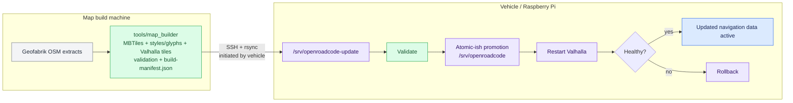

# Navigation Build and Deployment

OpenRoadCode deliberately separates navigation software, vehicle-local configuration, and large generated map/routing data. This allows the vehicle computer to remain a lean runtime target while a separate build machine performs expensive map generation.

## Filesystem contract

```text
/opt/openroadcode/navigation/
    installed software
    ├── bin/openroadcode-map-renderer
    └── valhalla/

/etc/openroadcode/
    navigation.toml

/srv/openroadcode/
    build-manifest.json
    maps/
        ├── search/openroadcode-search.sqlite
        ├── vector/openroadcode.mbtiles
        └── styles/openroadcode.json
    valhalla/
```

Ownership by purpose:

| Path | Owner/purpose |
| --- | --- |
| `/opt/openroadcode/navigation` | Installed navigation executables and libraries |
| `/etc/openroadcode/navigation.toml` | Vehicle-local runtime configuration |
| `/srv/openroadcode` | Versioned/deployable map and routing dataset |
| `/srv/openroadcode-update` | Temporary incoming dataset on the vehicle |
| `/srv/openroadcode-previous` | Previous dataset retained for rollback |

Map updates must not overwrite `/etc/openroadcode`.

## Architecture

<div class="orc-diagram-legend" aria-label="Architecture diagram legend">
  <strong>Diagram key</strong>
  <span><i class="orc-legend-swatch orc-legend-app"></i>App / UI</span>
  <span><i class="orc-legend-swatch orc-legend-service"></i>Service / runtime</span>
  <span><i class="orc-legend-swatch orc-legend-controller"></i>Controller / domain</span>
  <span><i class="orc-legend-swatch orc-legend-message"></i>Messaging / contract</span>
  <span><i class="orc-legend-swatch orc-legend-adapter"></i>Protocol / hardware</span>
  <span><i class="orc-legend-swatch orc-legend-external"></i>External / input</span>
</div>



The map-build machine is the authoritative producer of navigation data. The vehicle controls when it consumes a new dataset.

## 1. Install navigation software on the vehicle

From the OpenRoadCode repository on the Raspberry Pi:

```bash
./scripts/installers/install_navigation_stack.sh --target rpi5
```

Preview without modifying the system:

```bash
./scripts/installers/install_navigation_stack.sh --target rpi5 --show-plan
```

The installer builds/installs MapLibre Native integration, the OpenRoadCode native renderer, and Valhalla software beneath `/opt/openroadcode/navigation`.

Chromium is not a navigation dependency. The Linux navigation installer uses
the native MapLibre renderer; add the separate `browser` feature only for
browser-backed OpenRoadCode applications.

It does **not** build map data. Map generation belongs on the map-build machine.

The installer seeds `/etc/openroadcode/navigation.toml` from `config/navigation.toml` only when the deployed file does not already exist. Existing local configuration is preserved.

If Valhalla map data are not present yet, service installation is deferred until data have been deployed.

## 2. Build map/routing data on the build machine

From `tools/map_builder`:

```bash
./scripts/build-image.sh
./scripts/run-builder.sh build --regions north-america/us/michigan
```

Or select regions interactively:

```bash
./scripts/run-builder.sh tui
```

Successful output is written under `tools/map_builder/build-output/` using the same `/srv/openroadcode` paths expected by the vehicle.

The builder validates its output and writes `build-manifest.json`. A dataset without that manifest is not considered deployable.

See `tools/map_builder/README.md` for builder details and toolchain pinning.

## 3. Publish the dataset on the build machine

The vehicle pull script expects an SSH/rsync-readable directory containing the **contents** of the generated `/srv/openroadcode` tree.

A simple deployment on the build machine is:

```bash
cd tools/map_builder
./scripts/deploy-to-srv.sh
```

This makes `/srv/openroadcode` on the build machine the published dataset root.

SSH key authentication is recommended for unattended vehicle pulls. The vehicle only needs read access to the published tree.

## 4. Pull map data from the vehicle

First preview the transfer:

```bash
./scripts/runtime/pull_navigation_data.sh \
  --source mapbuilder@MAP_HOST:/srv/openroadcode \
  --dry-run
```

Then deploy:

```bash
./scripts/runtime/pull_navigation_data.sh \
  --source mapbuilder@MAP_HOST:/srv/openroadcode
```

The updater:

1. reads the remote `build-manifest.json` before transfer;
2. skips the update when the local and remote manifests already match;
3. downloads into `/srv/openroadcode-update`;
4. preserves vehicle-owned `maps/routes/` data;
5. validates the staged deployment contract, including the POI search index;
6. verifies that the staged manifest is the same manifest checked before transfer;
7. moves the previous dataset to `/srv/openroadcode-previous`;
8. promotes the staged dataset to `/srv/openroadcode`;
9. restarts Valhalla when its service is installed;
10. restores the previous dataset if Valhalla fails after promotion.

Useful options:

```text
--dry-run       preview rsync changes
--force         pull even when manifests match
--no-restart    do not restart Valhalla after promotion
```

The source can also be provided through `NAVIGATION_DATA_SOURCE`.

## Runtime renderer configuration

`/etc/openroadcode/navigation.toml` selects runtime behavior without changing the deployed dataset:

```toml
[map_renderer]
style = "/srv/openroadcode/maps/styles/openroadcode.json"
cache = "/var/cache/openroadcode/maplibre.db"

[vehicle_marker]
mode = "vehicle"
scale = 1.0
```

Supported marker modes are `blue_dot`, `heading`, and `vehicle`. Marker selection is local configuration; the style definitions themselves travel with the map package.

The intended `vehicle` presentation is a top-down red Hyundai Veloster. Until that artwork is added to the map/style asset package, the style uses a red placeholder marker.

## Updating marker choice

Edit the vehicle-local config:

```bash
sudo editor /etc/openroadcode/navigation.toml
```

For example:

```toml
[vehicle_marker]
mode = "blue_dot"
scale = 1.0
```

Restart the renderer after changing startup configuration.

## Validation and troubleshooting

Before first use after pulling repository changes:

```bash
bash -n scripts/installers/install_navigation_stack.sh
bash -n scripts/runtime/pull_navigation_data.sh
python3 -m pytest tools/map_builder/tests -v
```

Useful runtime checks on the vehicle include:

```bash
test -x /opt/openroadcode/navigation/bin/openroadcode-map-renderer
test -s /etc/openroadcode/navigation.toml
test -s /srv/openroadcode/build-manifest.json
test -s /srv/openroadcode/maps/styles/openroadcode.json
test -s /srv/openroadcode/maps/search/openroadcode-search.sqlite
test -s /srv/openroadcode/valhalla/valhalla.json
systemctl status valhalla.service
```

If a data promotion causes Valhalla to fail, `pull_navigation_data.sh` attempts automatic rollback. `/srv/openroadcode-previous` also provides an administrator-visible copy of the previous successful dataset until the next promotion.

## Design rules

- Build expensive map/routing data off-vehicle.
- Install executable software under `/opt`.
- Keep machine/vehicle configuration under `/etc`.
- Keep generated navigation data under `/srv`.
- Do not bake region names such as `michigan-test` into renderer code.
- Do not let map-data synchronization overwrite vehicle-local configuration.
- Treat `build-manifest.json` as the deployment identity and validation boundary.
- Preserve runtime-generated route/debug data across map updates.
# Runtime style ownership and city-weather diagnostics

The native dataset publisher repairs ownership of
`/srv/openroadcode/maps/styles/openroadcode.json` after rsync. ORC rewrites this
file to apply its theme, so the runtime account needs write access. Local
publication defaults to the invoking account (or `SUDO_USER`); remote publication
uses the SSH login account. `OPENROADCODE_RUNTIME_USER` overrides the account
on the machine performing the repair. The remaining map dataset does not need
to be writable by ORC.

If a previously installed style is still read-only, ORC logs the repair command
and retains that style instead of crashing during theme setup. The map theme
cannot change until permissions are repaired.

A city-weather query timeout means Python received no matching
`map.weather.cities` reply within ten seconds. It does not detect a renderer
version. Check that the native renderer and message bus are running and that
their endpoints match the UI configuration. If the installed native executable
predates `search_weather_cities`, rebuild/install it; pulling Python source alone
does not update `/opt/openroadcode/navigation/bin/openroadcode-map-renderer`.

## Desktop host location fallback

Desktop Linux navigation services offer browser geolocation alongside device
GPS. Eligibility checks the actual runtime and Pi hardware model, rather than
the saved install/build target: a desktop configured to build for `rpi5` still
offers the listener. In ORC, open **Settings → Share host location** to launch
the permission page using your default browser, including Firefox. Settings
checks the local service first and reports a stopped service or browser-launch
failure without blocking the UI. Browser permission remains a browser prompt;
ORC does not grant it or assume that opening the page means location is shared.
Leaving Settings cancels pending checks and stale UI completions. The page is
an ordinary browser tab and stays open when you return to ORC.

Alternatively, open
<http://localhost:8765/> **on the computer running the navigation service**, click
**Share host location**, and allow the browser's location permission. The page
shows reported accuracy and must remain open. It does not request location until
you click Share. Stop sharing or closing the page stops further browser updates;
it does not erase the map's last known position.

The service prefers valid, uncached bridge/GPS fixes received within the last
ten seconds. When those stop, fresh browser reports can take over. A new bridge
fix immediately regains priority. Browser location retains its `browser` source
and accuracy; it provides position only, not vehicle motion or inertial data.
Host/browser location can be approximate, require Internet access, or be
unavailable; permission alone does not guarantee a fix. No IP-location provider
or paid API is added by ORC. The browser may use its own location service.

Update and restart an installed desktop navigation service:

```bash
git switch navigation-cesium
git pull --ff-only
sudo systemctl restart openroadcode-navigation.service
```

For a foreground navigation service instead, stop the installed service first
to avoid duplicate publishers/listeners, then run:

```bash
git switch navigation-cesium
bash scripts/runtime/start_navigation_service.sh --profile local
```

The permission page prints its URL at startup. `OPENROADCODE_BROWSER_POSITION_PORT`
can change the default port; the listener is bound to loopback. An occupied port
logs a warning and does not disable working bridge/GPS input. Termux and vehicle
Pi hardware keep their existing device sources. The parser also accepts explicit
`services.navigation.inputs.gps.source = "browser"` for compositions that do not
apply a device-source profile overlay. Route playback remains separate and
continues to suppress both live sources until simulation ends.
