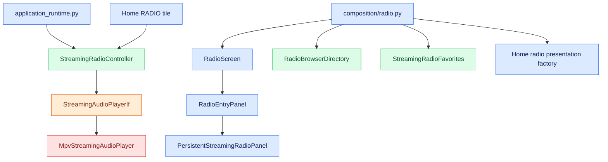

# Streaming Radio

## Overview

Streaming Radio adds internet station discovery and audio playback to the ORC Radio screen without replacing the SDR++ RF path. The Radio chooser offers RF Radio and Streaming Radio. The streaming browser provides Local, Regional, and Favorites views plus filtering, station artwork, selection, playback controls, and shared Home now-playing state.

Radio Browser supplies station discovery and current metadata. mpv supplies audio playback. Internet access is required for directory requests and remote streams; the streaming path itself does not require an SDR receiver.

## Architecture and ownership

The current composition architecture separates runtime ownership from presentation ownership:

<aside class="orc-diagram-legend" aria-label="Architecture diagram legend">
  <strong>Diagram key</strong>
  <span><i class="orc-legend-swatch orc-legend-app"></i>App / UI</span>
  <span><i class="orc-legend-swatch orc-legend-service"></i>Service / runtime</span>
  <span><i class="orc-legend-swatch orc-legend-controller"></i>Controller / domain</span>
  <span><i class="orc-legend-swatch orc-legend-message"></i>Messaging / contract</span>
  <span><i class="orc-legend-swatch orc-legend-adapter"></i>Protocol / hardware</span>
  <span><i class="orc-legend-swatch orc-legend-external"></i>External / input</span>
</aside>



`OrcUiApplicationRuntime` owns playback lifetime and stops streaming playback during application cleanup. `RadioComposition` owns feature-scoped presentation dependencies such as the directory, favorites store, and screen. The shell exposes neutral Home and screen-host contracts; it does not construct Radio Browser, mpv, favorites, or SDR++ services itself.

Favorites are intentionally separate from station metadata. `StreamingRadioFavorites` stores only stable Radio Browser station UUIDs. When Favorites is opened, `RadioBrowserDirectory.stations_by_ids()` resolves those UUIDs to current names, stream URLs, artwork, and other metadata. This avoids persisting stale stream URLs or duplicating directory records locally.

Favorites use the shared byte-oriented `PersistentCache`; serialization and validation remain domain policy in `StreamingRadioFavorites`. The storage root is OpenRoadCode user data rather than disposable cache data:

```text
${XDG_DATA_HOME:-~/.local/share}/openroadcode/radio/
```

The earlier TOML favorites format under `${XDG_CONFIG_HOME:-~/.config}/openroadcode/streaming_radio.toml` is read for migration when no new-format favorites exist; the legacy file is not deleted.

## Discovery and filtering

`StreamingRadioDirectoryIf` supports name search, station-ID resolution, regional discovery, and nearby discovery. `RadioBrowserDirectory` maps Radio Browser JSON responses into immutable `StreamingRadioStation` values. Favorites are resolved through Radio Browser's UUID lookup endpoint in one batched request and reordered to match saved favorite order.

The integrated browser currently defaults local discovery to Detroit coordinates, an 80 km radius, and Michigan. This remains a development default rather than live GPS-driven discovery.

The filter drawer provides genre/content, reported stream quality, and band/origin filters. Internet-only classification is conservative and tag-based because Radio Browser does not provide an authoritative terrestrial-versus-internet-native field. FM/AM/DAB classification is best-effort metadata inference and should not be treated as authoritative RF information.

## Playback and presentation

Directory and favorite-resolution work runs off the Tk event thread. Playback requests also run on a worker thread. Station cards show selection, favorite state, and playback state; the active stream receives stronger now-playing treatment and a Stop action. Home observes the same controller, so navigating away from Radio does not intentionally stop playback.

`MpvStreamingAudioPlayer` launches mpv in audio-only mode and owns the process lifecycle. `is_playing` currently means the mpv process is alive; it does not prove that buffering completed or audio is audible.

## Installation

From the repository root:

```bash
# Debian/Ubuntu
bash development/debian/install_streaming_radio.sh

# Termux
bash development/termux/install_streaming_radio.sh
```

Use the installer for the environment in which ORC and mpv actually run. The Termux installer includes its certificate dependency checks.

## Validation

Run the focused deterministic tests:

```bash
PYTHONPATH=. python -m unittest -v \
  common.unit_test.test_xdg_paths \
  controllers.radio.unit_test.test_streaming_radio \
  controllers.radio.unit_test.test_streaming_radio_controller \
  controllers.radio.unit_test.test_streaming_radio_favorites \
  hardware_io.audio.unit_test.test_mpv_streaming_audio_player
```

Run the opt-in live Radio Browser component test:

```bash
ORC_RUN_NETWORK_COMPONENT_TESTS=1 PYTHONPATH=. \
python -m unittest -v controllers.radio.component_test.test_radio_browser_directory
```

Launch the integrated UI:

```bash
PYTHONPATH=. python -m apps.orcUi
```

For the 1024×600 acceptance pass, verify the Radio chooser, Local and Regional station loading, filter drawer layout, play/stop, Home now-playing state, favorite add/remove, Favorites reload after restarting ORC, direct RF/Streaming shortcuts, return navigation, shutdown while streaming, directory failure, and an invalid stream.

## Remaining limitations

Streaming Radio does not yet provide GPS-driven local discovery, authoritative broadcast-band classification, integrated station search in the Tk browser, track metadata, mpv IPC, buffering/reconnect state, or shared audio-focus arbitration. The streaming browser presentation is also being reconciled with the current CSS-derived `ThemeBundle`; local palette values should not become a second visual source of truth.

## Related documentation

- [XDG Paths](xdg_paths.md)
- [Termux development target](../development/termux/README.md)
