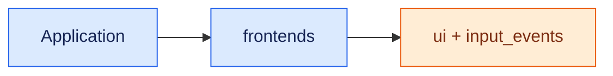

# Frontends

`frontends` contains reusable concrete UI implementations. The current
graphical frontend uses Tkinter, and `frontends/tui` provides reusable curses
views. Another frontend, such as Qt, can implement the same contracts without
changing the toolkit-independent models under `ui`.

## Dependency boundary

<aside class="orc-diagram-legend" aria-label="Architecture diagram legend">
  <strong>Diagram key</strong>
  <span><i class="orc-legend-swatch orc-legend-app"></i>App / UI</span>
  <span><i class="orc-legend-swatch orc-legend-service"></i>Service / runtime</span>
  <span><i class="orc-legend-swatch orc-legend-controller"></i>Controller / domain</span>
  <span><i class="orc-legend-swatch orc-legend-message"></i>Messaging / contract</span>
  <span><i class="orc-legend-swatch orc-legend-adapter"></i>Protocol / hardware</span>
  <span><i class="orc-legend-swatch orc-legend-external"></i>External / input</span>
</aside>



Frontend code must not import `apps.carUi`. Application routes, domain
controllers, resource ownership, and product-specific composition remain in
the application package.

The common input dispatcher consumes only the neutral physical-input contracts
from `input_events`. It does not import controller policy or implementations.
It queues physical events until the selected frontend thread can deliver them.

## Package map

- `common/input/` provides the thread-safe physical-input event queue shared by
  frontend event loops.
- `tk/runtime/` owns Tk window and display runtime helpers.
- `tk/menu/` renders toolkit-independent `ui.menu` models.
- `tk/system/` contains persistent top bar, status, volume, and startup widgets.
- `tk/media/`, `tk/lighting/`, and `tk/radio/` provide reusable domain screens
  and panels. Tk media includes rich Spotify playback plus reusable Netflix
  and YouTube browser panels; application-owned services are injected through
  narrow protocols.
- `tk/automotive/` provides reusable vehicle and off-road dashboard panels.
- `tui/automotive/` provides reusable navigation and vehicle terminal views.
- `tk/aircraft/` and `tk/weather/` contain reusable menu panels used by Car UI
  destinations.

## Extension rules

- Put navigable destinations in a frontend-specific screen module.
- Put reusable, non-navigable regions in panel modules.
- Accept data and request-handler contracts from `ui`; do not reach into an
  application or controller implementation to fetch state.
- Inject theme values, callbacks, hosts, and services rather than importing an
  application singleton.
- Keep domain logic and hardware ownership outside widget classes.
- Schedule widget mutations on the frontend event-loop thread.

A new frontend supplies its own shell, dispatcher, screen host, menu renderer,
and application screen factory. It can reuse the contracts and menu models in
`ui` while making no dependency on Tkinter.

## Documentation and tests

```bash
venv/bin/python scripts/check_doxygen_contracts.py
venv/bin/python -m unittest discover \
  -s frontends/common/input/unit_test -p 'test_*.py'
doxygen Doxyfile
```

Generated API documentation is written under `build/doxygen/html`.
