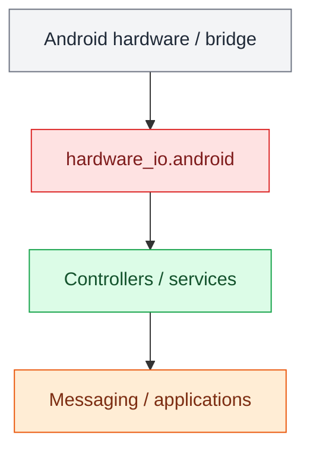

# Android Hardware I/O

`hardware_io.android` contains hardware-facing access to sensors supplied by the
OpenRoadCode Android sensor bridge. The bridge listens only on the phone's
localhost interface, currently at `http://127.0.0.1:8766`.

The layering is intentionally:

<aside class="orc-diagram-legend" aria-label="Architecture diagram legend">
  <strong>Diagram key</strong>
  <span><i class="orc-legend-swatch orc-legend-app"></i>App / UI</span>
  <span><i class="orc-legend-swatch orc-legend-service"></i>Service / runtime</span>
  <span><i class="orc-legend-swatch orc-legend-controller"></i>Controller / domain</span>
  <span><i class="orc-legend-swatch orc-legend-message"></i>Messaging / contract</span>
  <span><i class="orc-legend-swatch orc-legend-adapter"></i>Protocol / hardware</span>
  <span><i class="orc-legend-swatch orc-legend-external"></i>External / input</span>
</aside>



`AndroidSensorBridgeClient` is the low-level bridge client. Its IMU snapshot
contains accelerometer, linear acceleration, gyroscope, magnetometer, and
barometric-pressure data when those sensors are available on the phone.

`AndroidMagnetometer` is the hardware-facing magnetometer device. Navigation
code should adapt this device to its own contracts rather than reading Android
sensor payloads directly.

## Magnetometer component test

Start the Android bridge application, then from the OpenRoadCode checkout in
Termux run:

```bash
python -m hardware_io.android.component_test.magnetometer_cli
```

Rotate the phone through several orientations. The X/Y/Z magnetic field values
and field magnitude should change continuously. Ctrl+C stops the test.

## Sensor bridge diagnostic

The bridge can be checked independently of Python with:

```bash
curl http://127.0.0.1:8766/health
curl http://127.0.0.1:8766/imu
```

The `/imu` response is diagnostic/raw bridge data. Application code should use
`hardware_io` interfaces and adapters instead of depending on the HTTP schema.
