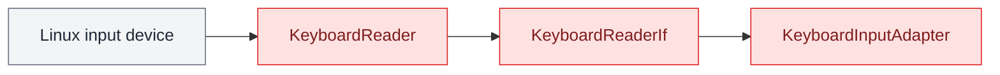

# Keyboard Reader

`KeyboardReaderIf` defines the hardware contract for normalized keyboard input.
`KeyboardReader` is the Linux `evdev` implementation.

It uses `evdev` to monitor keyboard events and reports the Linux key name when a key is pressed.

<aside class="orc-diagram-legend" aria-label="Architecture diagram legend">
  <strong>Diagram key</strong>
  <span><i class="orc-legend-swatch orc-legend-app"></i>App / UI</span>
  <span><i class="orc-legend-swatch orc-legend-service"></i>Service / runtime</span>
  <span><i class="orc-legend-swatch orc-legend-controller"></i>Controller / domain</span>
  <span><i class="orc-legend-swatch orc-legend-message"></i>Messaging / contract</span>
  <span><i class="orc-legend-swatch orc-legend-adapter"></i>Protocol / hardware</span>
  <span><i class="orc-legend-swatch orc-legend-external"></i>External / input</span>
</aside>



## Keyboard Input

The `KeyboardReader` reports Linux key names such as:

```text
KEY_LEFT
KEY_RIGHT
KEY_ENTER
KEY_SPACE
```

The reader only reports which key was pressed.

Application-specific key mappings and behavior should be handled by higher-level components.

## Example

```python
from hardware_io.keyboard import KeyboardReader, KeyboardReaderIf


def key_pressed(key: str) -> None:
    print(f"Pressed: {key}")


reader: KeyboardReaderIf = KeyboardReader(callback=key_pressed)
reader.start()
```

## Component Test

A simple CLI component test is provided in the `component_test` directory.

```text
keyboard/
└── component_test/
    ├── __init__.py
    └── keyboard_cli.py
```

Run the component test from the project root:

```bash
python3 -m hardware_io.keyboard.component_test.keyboard_cli
```

The CLI displays the selected Linux input device and prints each key as it is pressed.

Example output:

```text
Reading keyboard: Logitech USB Keyboard
Device: /dev/input/event3
Press Ctrl+C to exit.

Key pressed: KEY_A
Key pressed: KEY_LEFT
Key pressed: KEY_ENTER
```

A specific Linux input device can also be selected:

```bash
python3 -m hardware_io.keyboard.component_test.keyboard_cli \
    --device /dev/input/event3
```

Press `Ctrl+C` to stop the component test.

## Dependency

The keyboard reader requires `evdev`.

Install the dependency using:

```bash
python3 -m pip install evdev
```

The user running this component must have permission to read Linux input devices.

On Debian or Raspberry Pi OS, the user can be added to the `input` group:

```bash
sudo usermod -aG input "$USER"
```

Log out and back in after changing group membership.

## Design

`KeyboardReaderIf` exposes device identity, synchronous iteration, background
monitoring, and idempotent resource cleanup without depending on `evdev`.
Importing the interface does not load the optional Linux implementation.

`KeyboardReader` is responsible only for reading Linux keyboard events and
reporting which key was pressed. `KeyboardInputAdapter` converts those key
names into generic `InputEvent` values; `InputMapper` assigns semantic
`UiAction` values.

It does not assign application-specific commands or behavior to keyboard input.

Higher-level components are responsible for interpreting keyboard events.

Run the keyboard unit tests with:

```bash
python3 -m unittest discover \
  -s hardware_io/keyboard/unit_test \
  -p 'test_*.py'
```
