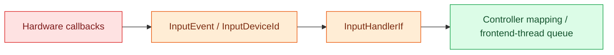

# Input Events

`input_events` owns normalized physical-input values and the consumer contract
shared across hardware adapters, controllers, frontend event queues, and
application composition.

These types describe only what physically happened. They do not assign UI
meaning, depend on a widget toolkit, operate hardware, or select application
behavior.



- `InputDeviceType` identifies the category of physical device.
- `InputDeviceId` distinguishes instances within a category.
- `InputEventType` identifies normalized physical activity.
- `InputEvent` combines the device, event type, and optional payload.
- `InputHandlerIf` consumes normalized events without owning their meaning.

New code should import these names from `input_events`. Compatibility exports
remain under `controllers.input` so existing integrations can migrate without
an immediate breaking change.

This package must remain limited to shared event values and producer/consumer
contracts. Hardware drivers, controller mappings, UI actions, frontend-thread
dispatch, and application configuration belong to their respective layers.

## Tests and API documentation

From the repository root:

```bash
venv/bin/python -m unittest discover \
  -s input_events/unit_test -p 'test_*.py'
venv/bin/python scripts/check_doxygen_contracts.py
doxygen Doxyfile
```

`input_events` is included in the root `Doxyfile`. Generated API documentation
is written under `build/doxygen/html`.
