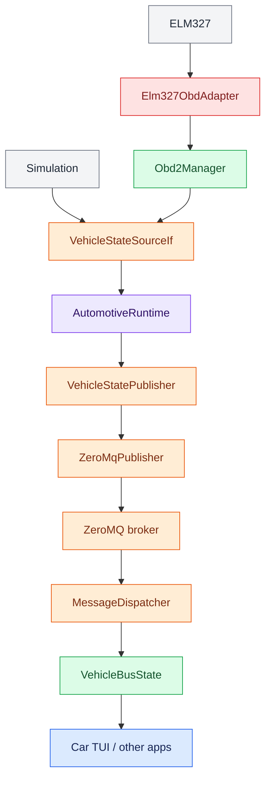
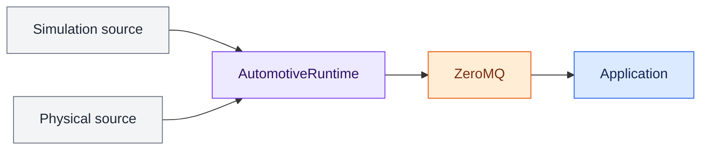

# Automotive Service

The automotive service owns a `VehicleStateSourceIf` and publishes complete SI-normalized `VehicleState` snapshots onto the OpenRoadCode ZeroMQ telemetry bus.

Applications such as Car TUI consume the public vehicle-state topic. They do not own the OBD-II adapter or simulation source.

## Data flow

<aside class="orc-diagram-legend" aria-label="Architecture diagram legend">
  <strong>Diagram key</strong>
  <span><i class="orc-legend-swatch orc-legend-app"></i>App / UI</span>
  <span><i class="orc-legend-swatch orc-legend-service"></i>Service / runtime</span>
  <span><i class="orc-legend-swatch orc-legend-controller"></i>Controller / domain</span>
  <span><i class="orc-legend-swatch orc-legend-message"></i>Messaging / contract</span>
  <span><i class="orc-legend-swatch orc-legend-adapter"></i>Protocol / hardware</span>
  <span><i class="orc-legend-swatch orc-legend-external"></i>External / input</span>
</aside>



The telemetry contract remains SI regardless of how a UI displays values. Metric/imperial conversion belongs at the presentation layer and uses `common.units`.

## Runtime configuration

The automotive service is configured through the same runtime TOML used by the other producer services.

Simulation example:

```toml
[services.automotive]
enabled = true
rate_hz = 10.0

[services.automotive.input]
source = "simulation"

[services.automotive.publish]
enabled = true
source = "simulated-vehicle"
```

Physical serial ELM327 example for Linux/Raspberry Pi:

```toml
[services.automotive]
enabled = true
rate_hz = 10.0

[services.automotive.input]
source = "device"
device = "elm327"
transport = "serial"
port = "/dev/rfcomm0"
baud = 38400
timeout_s = 1.0
hot_poll_hz = 20.0
standard_poll_hz = 5.0
slow_poll_interval_s = 5.0

[services.automotive.publish]
enabled = true
source = "obd2"
```

Termux uses the Android Bluetooth bridge over localhost TCP rather than a local
serial device:

```toml
[services.automotive]
enabled = true
rate_hz = 10.0

[services.automotive.input]
source = "device"
device = "elm327"
transport = "tcp"
host = "127.0.0.1"
tcp_port = 35000
timeout_s = 2.0
hot_poll_hz = 20.0
standard_poll_hz = 5.0
slow_poll_interval_s = 5.0

[services.automotive.publish]
enabled = true
source = "automotive-service-android"
```

`Elm327Device` owns the serial transport and `Elm327TcpDevice` owns the TCP
transport. Both feed the same `Elm327ObdAdapter`, `Obd2Manager`,
`AutomotiveRuntime`, and public `VehicleState` contract. This keeps the
Raspberry Pi/Linux and Termux compositions symmetric above the transport
boundary.

The manager uses three polling lanes to keep latency-sensitive gauges responsive
without wasting ELM327 bandwidth:

- **Hot** (`hot_poll_hz`, default 20 Hz): engine RPM and manifold absolute pressure.
  Boost is derived from MAP and cached barometric pressure, so RPM and boost are
  refreshed on every hot cycle.
- **Standard** (`standard_poll_hz`, default 5 Hz): vehicle speed, throttle,
  accelerator pedal, calculated load, commanded equivalence ratio, and direct
  fuel rate when supported.
- **Slow** (`slow_poll_interval_s`, default 5 s): barometric pressure, MAF,
  coolant temperature, intake temperature, fuel level, and module voltage.

`Obd2Manager` caches the most recent value from each lane and still returns a
complete `VehicleState` on every hot cycle. OBD requests remain serialized
through the single ELM327 command stream; the implementation does not issue
concurrent PID requests.

## ECU telemetry boundary

`VehicleStateSourceIf` remains the hardware-facing automotive interface for
both ordinary gauges and ECU-oriented telemetry. RPM, MAP, throttle, load,
commanded equivalence ratio, and similar values are all decoded vehicle state,
so they do not require a separate ECU transport contract.

A dedicated ECU-domain interface should be introduced only when OpenRoadCode
gains a controller that owns richer derived ECU concepts such as closed-loop
state, enrichment strategy, fuel trims, knock response, or control-state
history. Keeping that distinction avoids duplicating the same raw telemetry
across multiple interfaces.

## Gear estimation

The automotive runtime can augment each published `VehicleState` with an
estimated `transmission_gear`. The estimator compares engine speed and road
speed against a learned ratio profile.

By default the service looks for `vehicle_gears.learned.toml`. A different
profile can be supplied with `--gear-profile`. If the profile does not exist,
gear estimation is safely disabled.

Learn a manual-transmission profile with:

```bash
python -m scripts.automotive.learn_gears
```

The ratio estimator identifies forward gears only. RPM and road speed alone
cannot reliably distinguish neutral or reverse, and the estimator intentionally
returns an unknown gear during shifts, clutch slip, very low speed, or a poor
ratio match.

`transmission_gear` is part of the public `openroad.vehicle.state` schema.
After deploying a wire-contract change, restart long-running supervised
producer processes so an older service does not continue publishing the prior
schema.

## Start locally

Start the ZeroMQ broker first:

```bash
python3 -m messaging.zeromq.broker_cli
```

Simulation:

```bash
python3 -m services.automotive.automotive_service_cli \
  --config config/runtime.simulated.toml
```

Physical vehicle:

```bash
python3 -m services.automotive.automotive_service_cli \
  --config config/runtime.toml
```

For a serial Bluetooth ELM327 on Linux/Raspberry Pi, `/dev/rfcomm0` must already exist and be connected before starting the service. Termux instead uses the configured Android bridge TCP endpoint.

The service publishes to `[messaging].publisher_endpoint` at the configured `rate_hz`.

## Consumer example

Car TUI already subscribes to vehicle telemetry through its shared `VehicleBusState`. With the broker and automotive service running, start it normally:

```bash
python3 -m apps.carTui.main
```

The Vehicle screen updates as new `VehicleState` messages arrive. No automotive simulation or OBD-II object is constructed inside Car TUI.

## Design rule

Producer services own hardware and simulation sources. Applications consume messaging contracts. This keeps the consumer path identical between bench simulation and the vehicle:



Switching between simulation and physical hardware therefore changes service composition, not application code or the wire contract.
