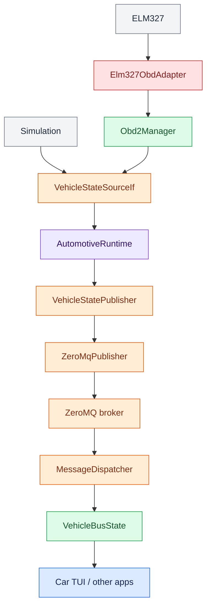
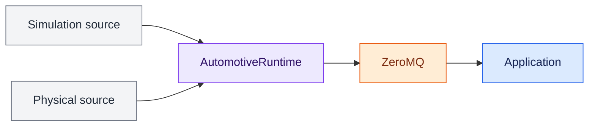

# Automotive Service

The automotive service owns a `VehicleStateSourceIf` and publishes complete SI-normalized `VehicleState` snapshots onto the OpenRoadCode ZeroMQ telemetry bus.

Applications such as Car TUI consume the public vehicle-state topic. They do not own the OBD-II adapter or simulation source.

## Data flow

<div class="orc-diagram-legend" aria-label="Architecture diagram legend">
  <strong>Diagram key</strong>
  <span><i class="orc-legend-swatch orc-legend-app"></i>App / UI</span>
  <span><i class="orc-legend-swatch orc-legend-service"></i>Service / runtime</span>
  <span><i class="orc-legend-swatch orc-legend-controller"></i>Controller / domain</span>
  <span><i class="orc-legend-swatch orc-legend-message"></i>Messaging / contract</span>
  <span><i class="orc-legend-swatch orc-legend-adapter"></i>Protocol / hardware</span>
  <span><i class="orc-legend-swatch orc-legend-external"></i>External / input</span>
</div>


```mermaid
flowchart TD
    sim["Simulation"] --> sourceIf["VehicleStateSourceIf"]
    elm["ELM327"] --> adapter["Elm327ObdAdapter"] --> obd["Obd2Manager"] --> sourceIf
    sourceIf --> runtime["AutomotiveRuntime"] --> publisher["VehicleStatePublisher"]
    publisher --> zmqPub["ZeroMqPublisher"] --> broker["ZeroMQ broker"]
    broker --> dispatcher["MessageDispatcher"] --> state["VehicleBusState"] --> apps["Car TUI / other apps"]

    classDef orcApp fill:#dbeafe,stroke:#2563eb,color:#172554;
    classDef orcService fill:#ede9fe,stroke:#7c3aed,color:#2e1065;
    classDef orcController fill:#dcfce7,stroke:#16a34a,color:#14532d;
    classDef orcMessage fill:#ffedd5,stroke:#ea580c,color:#7c2d12;
    classDef orcAdapter fill:#fee2e2,stroke:#dc2626,color:#7f1d1d;
    classDef orcExternal fill:#f3f4f6,stroke:#6b7280,color:#1f2937;
    class sim,elm orcExternal;
    class adapter orcAdapter;
    class obd,state orcController;
    class sourceIf,publisher,zmqPub,broker,dispatcher orcMessage;
    class runtime orcService;
    class apps orcApp;
```

The telemetry contract remains SI regardless of how a UI displays values. Metric/imperial conversion belongs at the presentation layer and uses `common.units`.

## Runtime configuration

The automotive service is configured through the same runtime TOML used by the other producer services.

Simulation example:

```toml
[services.automotive]
enabled = true
rate_hz = 10.0

[services.automotive.input]
source = "simulation"

[services.automotive.publish]
enabled = true
source = "simulated-vehicle"
```

Physical serial ELM327 example for Linux/Raspberry Pi:

```toml
[services.automotive]
enabled = true
rate_hz = 10.0

[services.automotive.input]
source = "device"
device = "elm327"
transport = "serial"
port = "/dev/rfcomm0"
baud = 38400
timeout_s = 1.0
request_rate_hz = 6.0

[services.automotive.publish]
enabled = true
source = "obd2"
```

Termux uses the Android Bluetooth bridge over localhost TCP rather than a local
serial device:

```toml
[services.automotive]
enabled = true
rate_hz = 10.0

[services.automotive.input]
source = "device"
device = "elm327"
transport = "tcp"
host = "127.0.0.1"
tcp_port = 35000
timeout_s = 2.0
request_rate_hz = 6.0

[services.automotive.publish]
enabled = true
source = "automotive-service-android"
```

`Elm327Device` owns the serial transport and `Elm327TcpDevice` owns the TCP
transport. Both feed the same `Elm327ObdAdapter`, `Obd2Manager`,
`AutomotiveRuntime`, and public `VehicleState` contract. This keeps the
Raspberry Pi/Linux and Termux compositions symmetric above the transport
boundary.

Real ELM327/Bluetooth links are request-limited, not CPU-limited. The Termux
KONNWEI path measured about 170 ms per request, or roughly six physical OBD
transactions per second. `request_rate_hz` therefore represents a physical
request budget, not a per-signal refresh rate.

`Obd2Manager` performs at most one PID request per service tick and returns a
complete snapshot from cached values. The active `AutomotiveTelemetryProfile`
changes how that scarce request budget is spent:

- `HOME` keeps glance telemetry fresh while preserving Trip inputs.
- `PERFORMANCE` strongly favors RPM and MAP/boost.
- `ENGINE` favors temperatures, load, and engine-health measurements.
- `ECU` favors trims, lambda, load, throttle-control, timing, and fuel-control data.
- `TRIP` favors fuel and trip-accounting inputs.
- `BACKGROUND` is deliberately Trip-biased while keeping low-rate engine context.

Unsupported PIDs discovered during Mode 01 capability discovery are omitted
entirely. A transient missing response does not erase the last valid cached
measurement.

The profile is a semantic priority hint, not an ELM327 contract. A future
passive-CAN or other automotive source may interpret the same profile
differently or ignore it when all signals are already available continuously.

See [Automotive Architecture](../../docs/automotive_architecture.md) for the
full source, domain, scheduling, ECU-analysis, Trip, and UI boundaries.

Road speed is not polled from OBD. Navigation ground motion owns vehicle speed
and is composed with the cached OBD engine state before publication.

## ECU telemetry boundary

`VehicleStateSourceIf` remains the hardware-facing automotive interface for
both ordinary gauges and ECU-oriented telemetry. RPM, MAP, throttle, load,
commanded equivalence ratio, and similar values are all decoded vehicle state,
so they do not require a separate ECU transport contract.

A dedicated ECU-domain interface should be introduced only when OpenRoadCode
gains a controller that owns richer derived ECU concepts such as closed-loop
state, enrichment strategy, fuel trims, knock response, or control-state
history. Keeping that distinction avoids duplicating the same raw telemetry
across multiple interfaces.

## Gear estimation

The automotive runtime can augment each published `VehicleState` with an
estimated `transmission_gear`. The estimator compares engine speed and road
speed against a learned ratio profile.

By default the service looks for `vehicle_gears.learned.toml`. A different
profile can be supplied with `--gear-profile`. If the profile does not exist,
gear estimation is safely disabled.

Learn a manual-transmission profile automatically from stable samples collected across a drive:

```bash
python -m scripts.automotive.learn_gears --gears 6
```

For a deliberate per-gear calibration, use guided mode:

```bash
python -m scripts.automotive.learn_gears --mode guided --gears 6
```

A single physical gear can be recaptured without discarding the other learned centers:

```bash
python -m scripts.automotive.learn_gears --gear 3 --gears 6
```

The learner rejects unstable RPM/speed windows and validates that learned ratios decrease as gear number increases. The default output is `vehicle_gears.learned.toml`; `--output` selects another profile path. Interactive prompts must be handled while safely stopped or by a passenger, never while driving.

The ratio estimator identifies forward gears only. RPM and road speed alone
cannot reliably distinguish neutral or reverse, and the estimator intentionally
returns an unknown gear during shifts, clutch slip, very low speed, or a poor
ratio match.

`transmission_gear` is part of the public `openroad.vehicle.state` schema.
After deploying a wire-contract change, restart long-running supervised
producer processes so an older service does not continue publishing the prior
schema.

## Start locally

Start the ZeroMQ broker first:

```bash
python3 -m messaging.zeromq.broker_cli
```

Simulation:

```bash
python3 -m services.automotive.automotive_service_cli \
  --config config/runtime.simulated.toml
```

Physical vehicle:

```bash
python3 -m services.automotive.automotive_service_cli \
  --config config/runtime.toml
```

For a serial Bluetooth ELM327 on Linux/Raspberry Pi, `/dev/rfcomm0` must already exist and be connected before starting the service. Termux instead uses the configured Android bridge TCP endpoint.

The service publishes to `[messaging].publisher_endpoint` at the configured `rate_hz`.

### Diagnostic component probe

With the automotive service running, exercise the same service-owned semantic
scanner and OBD request scheduler that the UI will use:

```bash
python -m controllers.automotive.obd2.component_test.obd2_diagnostics_cli \
  --endpoint tcp://127.0.0.1:5561
```

The command server queues the scan into `Obd2Manager`. Each automotive service
tick advances at most one diagnostic request instead of a normal telemetry PID,
so the scan observes `[services.automotive.input].request_rate_hz` and cannot
operate a concurrent request loop against the adapter. The default command
endpoint is configured by `[services.automotive].command_endpoint`.

## Structured logging

The service configures the shared [ORC JSON Lines logger](../../common/logging/README.md)
at startup. Its records use the same rotating store and live viewer as navigation
and the UI; no extra install dependencies are required.

Attach to automotive logs while ORC is running:

```bash
./runOrcUi --follow-logs --log-component automotive
```

`automotive.service` records configuration, disabled service/publishing, and
startup failures. `automotive.runtime` records publishing lifecycle, initial
source unavailability, connection loss, recovery, and fatal/cleanup failures.
Repeated failed connection attempts remain quiet until recovery; each connection
attempt gets a local operation ID shared with ELM327 initialization and PID discovery.

`automotive.elm327` records adapter connection/disconnection and DEBUG request
outcomes (mode, `obd_pid`, response count, exception type). `automotive.obd`
records capability counts, discovery fallback, profile changes, and DEBUG
missing responses. `pid` always identifies the logging process; `obd_pid` is the
OBD protocol PID. A missing response retains the existing cached measurement.

`automotive.profiles` correlates profile application with OBD profile changes.
Repeated unchanged profiles stay quiet at INFO. IDs are generated inside this
service and do not change the existing ZeroMQ profile-request or ELM327 wire
contracts. `automotive.motion` reports subscription lifecycle and speed
availability changes on received messages; this is not a stale-data timeout.

`automotive.trip` records start, pause/resume, completion, and reset using one
local operation ID per trip. Repeated observations and repeated finish/reset
calls stay quiet. UI processes need logging configured at their entry point
(ORCui already does this).

Structured automotive records exclude raw ELM327/CAN/ECU payloads, VINs,
diagnostic data, device addresses/paths, coordinates, driving measurements,
trip summaries, and exception messages. DEBUG enables request metadata and
publication events, without enabling payload dumps. Configure the service's
environment and restart it to change its threshold:

```bash
export ORC_LOG_COMPONENT_LEVELS='automotive.elm327=DEBUG,automotive.obd=DEBUG'
python3 -m services.automotive.automotive_service_cli --profile simulated
```

The Logging quality gate tests these events, schema, correlation, privacy
exclusions, quiet polling, reconnect behavior, and failure cleanup without a
vehicle or running broker. Real ELM327/Bluetooth behavior still needs an installed
system smoke test.

## Consumer example

Car TUI already subscribes to vehicle telemetry through its shared `VehicleBusState`. With the broker and automotive service running, start it normally:

```bash
python3 -m apps.carTui.main
```

The Vehicle screen updates as new `VehicleState` messages arrive. No automotive simulation or OBD-II object is constructed inside Car TUI.

## Design rule

Producer services own hardware and simulation sources. Applications consume messaging contracts. This keeps the consumer path identical between bench simulation and the vehicle:


```mermaid
flowchart LR
    sim["Simulation source"] --> runtime["AutomotiveRuntime"]
    physical["Physical source"] --> runtime
    runtime --> bus["ZeroMQ"] --> app["Application"]

    classDef orcApp fill:#dbeafe,stroke:#2563eb,color:#172554;
    classDef orcService fill:#ede9fe,stroke:#7c3aed,color:#2e1065;
    classDef orcController fill:#dcfce7,stroke:#16a34a,color:#14532d;
    classDef orcMessage fill:#ffedd5,stroke:#ea580c,color:#7c2d12;
    classDef orcAdapter fill:#fee2e2,stroke:#dc2626,color:#7f1d1d;
    classDef orcExternal fill:#f3f4f6,stroke:#6b7280,color:#1f2937;
    class sim,physical orcExternal;
    class runtime orcService;
    class bus orcMessage;
    class app orcApp;
```

Switching between simulation and physical hardware therefore changes service composition, not application code or the wire contract.
