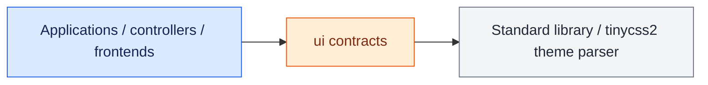

# UI Contracts

`ui` defines the toolkit-independent presentation contracts and value objects
shared by applications, controllers, and concrete frontends. Code in this
package must not import Tkinter, Qt, application composition, controllers, or
hardware implementations.

## Dependency boundary

<div class="orc-diagram-legend" aria-label="Architecture diagram legend">
  <strong>Diagram key</strong>
  <span><i class="orc-legend-swatch orc-legend-app"></i>App / UI</span>
  <span><i class="orc-legend-swatch orc-legend-service"></i>Service / runtime</span>
  <span><i class="orc-legend-swatch orc-legend-controller"></i>Controller / domain</span>
  <span><i class="orc-legend-swatch orc-legend-message"></i>Messaging / contract</span>
  <span><i class="orc-legend-swatch orc-legend-adapter"></i>Protocol / hardware</span>
  <span><i class="orc-legend-swatch orc-legend-external"></i>External / input</span>
</div>



Interfaces use the `*UiIf` or `*RequestHandlerIf` suffix. A UI interface
describes data a view can display; a request-handler interface describes
semantic user intent emitted by that view. Implementations should inherit only
the narrow contracts required by the screen or panel they represent.

## Package map

- `automotive/` contains vehicle, trip, body, tire, connection, and diagnostics
  presentation contracts.
- `lighting/` contains complete lighting state and lighting request contracts.
- `media/` contains media state plus playback, track, seek, and volume requests.
- `menu/` contains toolkit-independent menu-page and menu-tile models.
- `navigation/` contains position, orientation, ground-track, translation,
  angular-velocity, map, turn-by-turn route, and lane-guidance contracts.

Map and routing contracts are provider-neutral. A future MapLibre frontend may
render `MapState`, while a Valhalla adapter may produce `RouteGeometry`,
`RouteGuidanceState`, and `LaneGuidance`; neither product API belongs in `ui`.
- `radio/` contains receiver state, presets, tuning, playback, and application
  radio requests.
- `system/` contains diagnostics, status, top-bar, and system-volume contracts.
- Root modules contain cross-cutting screen, navigation, focus, action,
  dispatcher, event-handler, and frontend lifecycle contracts.

## Screens and panels

A screen is a navigable destination and implements `ScreenUiIf`. A screen can
compose any number of panels. A panel is a non-navigable region within a screen
or persistent shell chrome. Domain screens additionally implement only the
data contract they need, such as `MediaUiIf` or `LightingUiIf`.

The contracts intentionally do not prescribe widget types, layout, threading,
or event-loop behavior. Those decisions belong to a concrete frontend.

Normalized physical-input contracts are intentionally not UI contracts. They
live under `input_events`; `UiAction` remains here because it represents
toolkit-independent semantic UI intent after controller mapping.

## Stubs

`*_stub.py` classes provide inert or state-recording implementations for demos,
tests, and unavailable integrations. They implement the same public contracts
but do not introduce toolkit dependencies.

## Documentation and tests

Public methods in `*_if.py` modules document each parameter and non-`None`
return value with Doxygen commands. From the repository root, run:

```bash
venv/bin/python scripts/check_doxygen_contracts.py
venv/bin/python -m unittest discover -s ui/unit_test -p 'test_*.py'
doxygen Doxyfile
```

Generated API documentation is written under `build/doxygen/html`.


### Weather maps and radar replay

`ui/weather/weather_overlay_state.py` defines immutable city, heatmap and route
weather snapshots. Physical values are SI; route rain probability is a 0–1
fraction and times are aware UTC datetimes. `WeatherOverlayUiIf` is the state
consumer, `WeatherOverlayControlsIf` adds request binding, and
`WeatherOverlayRequestHandlerIf` describes city/model/route intent and navigation
visibility/replay. `RadarUiState`, `RadarControlsIf` and
`RadarRequestHandlerIf` provide the corresponding radar replay boundary.

Weather controller tests exercise asynchronous lifecycle and cache behavior
without Tk. Frontend contract tests exercise state consumption and request
forwarding. CI runs `scripts/check_weather_ui_contracts.py` to reject weather
provider/transport/thread imports in Tk weather views, backend-cache inspection,
and GUI imports in weather controllers. Interface documentation checks remain a
separate check; they do not substitute for this boundary enforcement.

## Replaceable UI boundary

UI contracts remain part of this repository. Frontends implement `*UiIf` and emit
semantic requests through `*RequestHandlerIf`; composition binds concrete
controllers and owns backend lifecycle. Frontends should consume shared state
from `ui/` rather than importing ORC controllers or application-specific wiring.

The static boundary check restricts contract imports to the standard library,
`ui`, and the existing `tinycss2` theme parser. Moving types into `ui/` preserves
backend compatibility through re-exports; existing enum and class identities
remain the same. Packaging and distribution changes require discussion with the
user before implementation.

## Remaining legacy boundary audit

Moving shared automotive, POI, radio, media, map, and launcher contract types
removed 64 of the original 122 import exceptions. Navigation/POI construction
cleanup removed another four. The remaining 54 imports are
listed exactly in `scripts/ui_boundary_exceptions.json`. Existing frontend portability is still incomplete. Their migration order is:

1. Spotify/media, streaming radio, and games: replace view-owned service calls,
   workers, polling, installation, and process lifecycle with state/request
   controllers; keep toolkit/native host adapters on the frontend side.
2. Navigation and ORC radio: move default controller/service construction into
   composition and expose POI/favorites/radio operations through narrow contracts.
3. Car UI factories: move backend wiring out of `screens/` into composition;
   replace concrete player/runtime annotations in screens with public contracts.
4. Platform launch adapters: keep native/browser access in platform adapters,
   inject their interfaces into domain controllers, and relocate backend factory
   construction to composition.
5. Startup/X11: distinguish loading presentation from startup worker ownership;
   retain subprocess access only in the native X11 adapter.

Each migration needs feature and lifecycle tests, and must remove its exact
exceptions. This inventory is architectural debt, not an allowance for new UIs.

| Existing module | Import exceptions | Required migration |
| --- | ---: | --- |
| `apps/carUi/screens/aircraft_screen.py` | 1 | Replace concrete runtime/player dependencies |
| `apps/carUi/screens/car_ui_screen_services.py` | 1 | Move factory wiring to composition |
| `apps/carUi/screens/netflix_screen.py` | 2 | Replace concrete runtime/player dependencies |
| `apps/carUi/screens/tk_car_ui_screen_factory.py` | 4 | Move factory wiring to composition |
| `apps/carUi/screens/weather_screen.py` | 1 | Replace concrete runtime/player dependencies |
| `apps/carUi/screens/youtube_screen.py` | 2 | Replace concrete runtime/player dependencies |
| `apps/orcUi/frontend/tk/radio_entry_panel.py` | 4 | Radio request/state contracts and service ownership |
| `apps/orcUi/frontend/tk/radio_panel.py` | 4 | Radio request/state contracts and service ownership |
| `controllers/navigation/google_earth_map_presentation.py` | 1 | Inject platform launcher interfaces |
| `controllers/poi/android_poi_action_executor.py` | 1 | Inject platform launcher interfaces |
| `controllers/video/netflix_player.py` | 1 | Inject platform launcher interfaces |
| `controllers/video/youtube_player.py` | 1 | Inject platform launcher interfaces |
| `frontends/tk/games/games_screen.py` | 7 | Game requests and runtime host adapter |
| `frontends/tk/media/media_screen.py` | 1 | Media state/request orchestration and async loading |
| `frontends/tk/media/spotify_browse_panel.py` | 4 | Media state/request orchestration and async loading |
| `frontends/tk/media/spotify_now_playing.py` | 3 | Media state/request orchestration and async loading |
| `frontends/tk/media/spotify_playback_panel.py` | 1 | Media state/request orchestration and async loading |
| `frontends/tk/media/spotify_screen.py` | 3 | Media state/request orchestration and async loading |
| `frontends/tk/radio/persistent_streaming_radio_panel.py` | 3 | Radio request/state contracts and service ownership |
| `frontends/tk/radio/streaming_radio_now_playing.py` | 1 | Radio request/state contracts and service ownership |
| `frontends/tk/radio/streaming_radio_panel.py` | 6 | Radio request/state contracts and service ownership |
| `frontends/tk/system/startup_splash.py` | 1 | Separate startup worker from loading view |
| `frontends/x11/x11_window_embedder.py` | 1 | Retain subprocess only in explicit native adapter |

### Navigation places contracts

`NavigationPlacesRequestHandlerIf` exposes saved shortcut destinations, search,
selection, native camera interaction notifications, and platform place actions.
The values are immutable UI types, including `MapFavorite` and `PointOfInterest`.
`NavigationPlacesFactoryIf` creates one mounted view's session. The panel rejects
untyped handlers, and the screen rejects untyped factories.

Composition constructs shared favorites/action adapters and a fresh POI search
controller for each mount. `NavigationPlacesController` implements the UI contract
and suppresses late results and requests after close. Hiding or destroying a panel
cancels its polling/debounce callbacks; hiding or closing the screen releases its
session. Factory shutdown closes surviving sessions, including when startup or
another cleanup fails. All close operations are idempotent.

`MapRuntimeIf` lives in `ui/navigation/map_runtime_if.py`; importing a map host
contract must not load application backend infrastructure. The static gate rejects
frontend imports from `apps.orcUi.core_runtime` as well as direct backend imports.

## Weather data health

`RadarUiState.data_status` carries the controller's human-readable imagery health
and freshness label. Optional `refreshed_at` is the Unix time of the last
successful metadata check, distinct from the selected frame's valid time.
Frontends format that time locally. Detailed errors remain in `status`.
Tile diagnostics, validation, retries, and freshness decisions belong to weather
controllers and services; views do not inspect those implementations.

City details are part of `CityWeatherOverlayState`: optional `details` contains
an immutable selected-city summary and `CityWeatherHour` rows in Kelvin, m/s,
and metres. `CityWeatherPoint.city_id` links the map feature to that selection.
`request_city_details(city_id)` opens a currently displayed city; passing `None`
dismisses it. Controllers own selection, cached-data lookup, playback pause and
lifecycle invalidation; frontends own local times, units and popup layout.

`MusicAnalysisSessionIf` describes the existing source-neutral HTTP audio-session
controls. The HTTP routes use this narrow structural contract instead of importing
the concrete session controller; transport paths and response behavior are unchanged.
